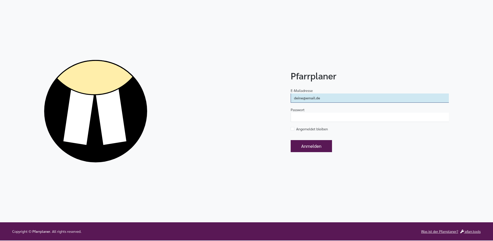

[//]: # (TOC: 3. Anmeldung und Benutzerkonto)

# Anmeldung und Benutzerkonto

Dieses Kapitel erklärt, wie Sie sich bei Pfarrplaner anmelden, Ihr Passwort verwalten und sich wieder abmelden.

Pfarrplaner ist nicht öffentlich zugänglich wie eine normale Website. Sie benötigen ein persönliches Konto, damit sichtbar ist, wer welche Gottesdienste, Dienste oder Daten bearbeiten darf.

---

## Benutzerkonto

Für die Nutzung von Pfarrplaner benötigen Sie ein persönliches Benutzerkonto. Dieses wird von Ihrem Administrator eingerichtet. Eine eigene Registrierung ist nicht möglich.

Ihr Administrator legt Ihr Konto an und weist Ihnen die nötigen Rechte zu. Die Zugangsdaten kommen danach automatisch per E-Mail. Nach der ersten Anmeldung müssen Sie das Anfangspasswort ändern, bevor Sie normal weiterarbeiten.

---

## Anmelden

Wenn Sie die Adresse von Pfarrplaner in Ihrem Browser aufrufen, erscheint zunächst die Anmeldeseite.

### So melden Sie sich an:

1. Geben Sie im Feld **E-Mailadresse** Ihre E-Mail-Adresse ein (dieselbe, mit der Ihr Konto angelegt wurde).
2. Geben Sie im Feld **Passwort** Ihr Passwort ein.
3. Klicken Sie auf die Schaltfläche **Anmelden**.

Die Anmeldeseite enthält diese Elemente:

- **E-Mailadresse**: Ihr Benutzername für Pfarrplaner.
- **Passwort**: Ihr persönliches Passwort.
- **Angemeldet bleiben**: Merkt sich die Anmeldung auf diesem Gerät länger.
- **Anmelden**: Prüft Ihre Eingaben und öffnet Pfarrplaner.

Nach erfolgreicher Anmeldung werden Sie zu der Startansicht weitergeleitet, die für Ihr Konto eingestellt ist. Häufig ist das die [Startseite](startseite.md), manchmal auch direkt der [Kalender](kalender.md) oder ein anderes Modul.

> **Tipp:** Wenn Sie das Häkchen bei „Angemeldet bleiben" setzen, werden Sie nicht automatisch abgemeldet, wenn Sie den Browser schließen. Nutzen Sie diese Option nur auf Ihrem eigenen Gerät, nicht auf gemeinsam genutzten Computern.

---

## Passwort vergessen

Auf der aktuellen Anmeldeseite gibt es keinen eigenen Link **Passwort vergessen?**. Wenn Sie Ihr Passwort nicht mehr wissen, wenden Sie sich bitte an eine Administratorin oder einen Administrator. Diese Person kann in der Benutzerverwaltung ein neues Passwort setzen oder Sie zum Ändern Ihres Passworts auffordern.

---

## Passwort ändern

Sie können Ihr Passwort jederzeit selbst ändern.

1. Klicken Sie oben rechts auf Ihren **Namen** (oder das Benutzersymbol).
2. Klicken Sie im Menü auf **Einstellungen**.
3. Öffnen Sie den Reiter **Sicherheit**.
4. Geben Sie Ihr aktuelles Passwort ein.
5. Geben Sie das neue Passwort ein und wiederholen Sie es zur Bestätigung.
6. Klicken Sie oben links auf **Speichern**.

> **Hinweis:** Ihr neues Passwort muss mindestens 8 Zeichen lang sein.

---

## Abmelden

Es ist wichtig, sich abzumelden, wenn Sie Pfarrplaner nicht mehr nutzen – besonders auf gemeinsam genutzten Computern.

1. Klicken Sie oben rechts auf Ihren **Namen**.
2. Klicken Sie im Dropdown-Menü auf **Abmelden**.

Sie werden dann zurück zur Anmeldeseite weitergeleitet.

---

## Konto gesperrt oder Probleme beim Anmelden?

Wenn Sie sich trotz richtigem Passwort nicht anmelden können, wenden Sie sich bitte an Ihren Administrator. Dieser kann Ihr Konto prüfen, entsperren oder ein neues Passwort setzen.

---

## Verwandte Kapitel

- [Persönliche Einstellungen](einstellungen.md): Profil, Passwort und Benachrichtigungen ändern
- [Startseite](startseite.md): Persönliche Übersicht nach der Anmeldung
- [Kalender](kalender.md): Gottesdienste und Veranstaltungen im Monatsüberblick
- [Administration](administration.md): Benutzerkonten verwalten, falls Sie Administratorrechte haben
