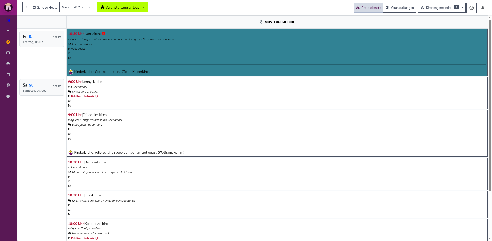
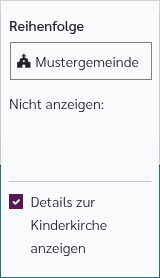
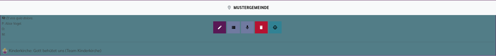
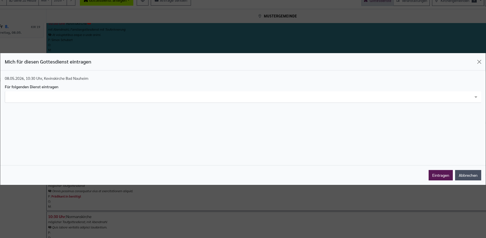
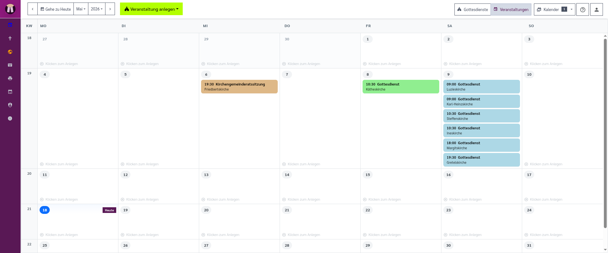

[//]: # (TOC: 5. Kalender)

# Kalender

Der Kalender zeigt die geplanten Gottesdienste und Veranstaltungen. Er ist der richtige Ort, wenn Sie wissen möchten, was in einem Monat stattfindet, wer für einen Gottesdienst eingeteilt ist, welche Gemeinden angezeigt werden oder ob noch Dienste fehlen.

Viele Benutzerinnen und Benutzer öffnen den Kalender von der [Startseite](startseite.md). Andere Konten können so eingestellt sein, dass Pfarrplaner nach der Anmeldung direkt den Kalender zeigt.

---

## Kalender aufrufen

Öffnen Sie den Kalender über den Menüpunkt **Kalender** oder über die Schaltfläche **Zum Kalender** auf der Startseite.

Oben im Kalender befindet sich die Bedienleiste. Rechts oben in derselben Leiste wählen Sie außerdem, ob Sie die Gottesdienst-Ansicht oder den Veranstaltungskalender sehen möchten. Darunter erscheint dann die passende Kalenderansicht.

---

## Zwischen Gottesdiensten und Veranstaltungen umschalten

Rechts oben in der oberen Leiste gibt es zwei Umschalter:

- **Kirchensymbol**: Zeigt die Gottesdienst-Ansicht. Diese Ansicht ist für die eigentliche Gottesdienstplanung gedacht.
- **Kalendersymbol**: Zeigt den Veranstaltungskalender. Diese Ansicht ist für andere Veranstaltungen und für eine klassische Monatsdarstellung gedacht.

Pfarrplaner merkt sich, welche Ansicht Sie zuletzt verwendet haben. Wenn Sie den Veranstaltungskalender öffnen, erscheint daneben zusätzlich die Schaltfläche **Kalender**. Dort wählen Sie aus, welche verbundenen Kalender eingeblendet werden sollen.

---

## Gottesdienst-Ansicht

Die Gottesdienst-Ansicht zeigt einen Monat als Tabelle. Links stehen die Tage, oben stehen die sichtbaren Gemeinden. Jede Zelle zeigt die Gottesdienste dieser Gemeinde an diesem Tag.

Ein Tageskopf enthält:

- **Wochentag und Datum**
- **Kalenderwoche**
- **Liturgische Farbe**
- **Predigttext oder Perikope**, falls vorhanden
- **Name des Sonntags oder Feiertags**, falls vorhanden
- **Abwesenheiten**, wenn Sie Urlaubseinträge lesen dürfen

Die Spalten zeigen die Gemeinden, die für Ihr Konto eingeblendet sind. Wenn eine übergeordnete Gemeinde angezeigt wird, können dort auch Gottesdienste der zugeordneten Untergemeinden erscheinen.

---

## Gemeinden anzeigen, ausblenden und sortieren

Die sichtbaren Gemeinden stellen Sie über die Schaltfläche **Kirchengemeinden** rechts oben in der oberen Leiste ein.

In der Schaltfläche **Kirchengemeinden** sehen Sie eine geordnete Liste aller verfügbaren Gemeinden. Ziehen Sie eine Gemeinde mit der Maus an eine andere Stelle, um die Reihenfolge der sichtbaren Spalten zu ändern.

Jeder Eintrag kann direkt ein- oder ausgeschaltet werden. Eingeschaltete Gemeinden erscheinen im Kalender. Ausgeschaltete Gemeinden bleiben in der Liste sichtbar, werden aber im Kalender nicht angezeigt.

Die Einstellung gilt für Ihr eigenes Konto. Andere Benutzerinnen und Benutzer behalten ihre eigene Ansicht.

---

## Navigation im Monat

In der Bedienleiste stehen diese Schaltflächen:

- **Pfeil nach links**: Einen Monat zurück.
- **Gehe zu Heute**: Springt zum aktuellen Monat. Wenn der aktuelle Monat schon geöffnet ist, scrollt die Seite zum heutigen Tag.
- **Monatsauswahl**: Öffnet eine Liste der Monate Januar bis Dezember.
- **Jahresauswahl**: Öffnet eine Liste der verfügbaren Jahre.
- **Pfeil nach rechts**: Einen Monat weiter.

Wählen Sie zuerst das Jahr und dann den Monat, wenn Sie weit in die Vergangenheit oder Zukunft wechseln möchten.

---

## Gottesdienst-Einträge lesen

Ein Gottesdienst erscheint als Kachel in der passenden Gemeinde-Spalte. In der Kachel werden die wichtigsten Informationen direkt angezeigt:

- **Uhrzeit**
- **Ort**
- **Titel oder besondere Bezeichnung**, wenn der Eintrag nicht nur „Gottesdienst“ heißt
- **Beschreibung**
- **Interne Anmerkung**, wenn eine vorhanden ist
- **Alle eingeteilten Dienste**: Pfarrer:in, Organist:in, Mesner:in und alle weiteren Dienstkategorien, die für diesen Gottesdienst eingetragen sind
- **Kasualien-Hinweise**, zum Beispiel Taufen oder Beerdigungen
- **Kinderkirche**, wenn sie für diesen Gottesdienst erfasst ist
- **Streaming-Links**, wenn ein YouTube-Link oder LiveDashboard vorhanden ist

Der eigene Name wird in den Diensteinträgen hervorgehoben. So erkennen Sie schnell, wo Sie selbst eingeteilt sind.

Wenn eine Uhrzeit rot angezeigt wird, weicht sie von der üblichen Uhrzeit des Ortes ab. Wenn ein Ort rot angezeigt wird, fehlt ein regulär ausgewählter Ort oder es handelt sich um eine besondere Ortsangabe.

---

## Bedeutung wichtiger Symbole

| Symbol | Bedeutung |
|---|---|
| :material-eye-off: | Die danebenstehende Anmerkung ist nur intern gedacht und erscheint nicht in öffentlichen Ausgaben. |
| :material-water: | Mit diesem Gottesdienst sind eine oder mehrere Taufen verbunden. Die Zahl daneben zeigt, wie viele Taufen es sind. |
| :material-grave-stone: | Mit diesem Gottesdienst ist eine Beerdigung verbunden. |
| Kinderkirche-Bild | Parallel zum Gottesdienst ist Kinderkirche eingetragen. Wenn Details zur Kinderkirche eingeblendet sind, sehen Sie Thema, Ort und Mitarbeitende. |
| :material-youtube: | Öffnet das YouTube-Video oder den Stream. |
| :material-video: | Öffnet das LiveDashboard, falls für die Gemeinde ein YouTube-Kanal eingerichtet ist. |
|  | Zeigt eine liturgische Farbe oder ein abweichendes Proprium. Die tatsächliche Farbe hängt vom Kirchenjahr ab. |
| :material-virus-off: | Zeigt eine Zugangsbeschränkung mit Hinweis wie **Test nötig** oder **Test empfohlen**. |
| :material-earth: | Zeigt eine Abwesenheit im Tageskopf. |

Ein blasser oder grauer Gottesdienst gehört zu einer anderen Gemeinde-Spalte oder ist für öffentliche Listen als versteckt markiert. Öffentliche Sichtbarkeit bearbeiten Sie im [Editor für Veranstaltungen und Gottesdienste](veranstaltungen.md).

---

## Gottesdienst öffnen und Schaltflächen in der Kachel

Wenn Sie einen Gottesdienst bearbeiten dürfen, können Sie die Kachel anklicken. Wenn Sie den Mauszeiger auf eine Gottesdienst-Kachel bewegen, erscheinen zusätzliche Schaltflächen:

- **:material-pencil: Stift**: Gottesdienst im [Editor für Veranstaltungen und Gottesdienste](veranstaltungen.md) bearbeiten.
- **:material-view-list: Listen-Symbol**: [Liturgie-Editor](liturgie.md) öffnen.
- **:material-microphone: Mikrofon**: [Predigteditor](predigt.md) öffnen.
- **:material-delete: Papierkorb**: Gottesdienst löschen. Nutzen Sie diese Funktion nur, wenn der Eintrag wirklich entfernt werden soll.
- **:material-target-account: Zielscheibe mit Person**: Sich selbst für einen Dienst in diesem Gottesdienst eintragen.

Wenn Sie den Gottesdienst nicht bearbeiten dürfen, können trotzdem Schaltflächen sichtbar sein:

- **:material-view-list: Listen-Symbol**: Liturgie ansehen.
- **:material-target-account: Zielscheibe mit Person**: Sich selbst für einen Dienst eintragen, falls erlaubt.

Wenn Sie beim Öffnen einer Schaltfläche die Strg-Taste gedrückt halten, kann die Zielseite in einem neuen Tab geöffnet werden.

---

## Mich selbst für einen Dienst eintragen

Klicken Sie bei einem Gottesdienst auf die **Zielscheibe mit Person**. Es öffnet sich ein Fenster **„Mich für diesen Gottesdienst eintragen“**.

1. Prüfen Sie Datum, Uhrzeit und Ort.
2. Wählen Sie im Feld **Für folgenden Dienst eintragen** einen oder mehrere Dienste aus.
3. Bestätigen Sie mit **Eintragen**.

Pfarrplaner merkt sich die zuletzt gewählte Dienstauswahl für Ihr Konto. Wenn mehrere Personen dieselbe Aufgabe planen, prüfen Sie danach den Gottesdiensteintrag.

---

## Benutzer schnell zuordnen

Die Funktion **Benutzer schnell zuordnen** erkennen Sie in der Bedienleiste am Symbol mit der Zielscheibe.

Damit können Sie eine oder mehrere Personen schnell in mehrere Gottesdienste eintragen, ohne jeden Gottesdienst einzeln zu öffnen.

1. Klicken Sie in der Bedienleiste auf die Zielscheibe.
2. Wählen Sie im Fenster **Person(en) schnell eintragen** die gewünschten Personen aus.
3. Wählen Sie bei **Für folgenden Dienst eintragen** den Dienst, zum Beispiel Pfarrer:in, Organist:in, Mesner:in oder eine weitere Dienstkategorie.
4. Entscheiden Sie, ob **Bestehende Einträge überschreiben** aktiviert werden soll.
5. Klicken Sie auf **Aktivieren**.
6. Klicken Sie danach im Kalender auf die Gottesdienste, denen diese Person oder diese Personen zugeordnet werden sollen.

Solange **Benutzer schnell zuordnen** aktiv ist, werden mögliche Ziele hervorgehoben. Das Symbol in der Bedienleiste wird gelb. Klicken Sie erneut auf die Zielscheibe, um die Funktion wieder auszuschalten.

Wenn **Bestehende Einträge überschreiben** nicht aktiviert ist, werden die Personen zusätzlich eingetragen. Wenn es aktiviert ist, ersetzt die Auswahl die bisherigen Personen dieses Dienstes.

---

## Dienstanfrage senden

In der Gottesdienst-Ansicht gibt es die Schaltfläche **Anfrage senden...** mit einem E-Mail-Symbol. Damit öffnen Sie den Bericht **Dienstanfrage per E-Mail**.

Dort wählen Sie aus, für welchen Zeitraum, welche Orte, welche Dienste und welche Gottesdienste eine Anfrage erstellt werden soll. Pfarrplaner bereitet daraus E-Mails oder eine Liste vor, mit der Mitarbeitende für offene Dienste angefragt werden können.

Mehr zu Berichten und Ausgaben steht im Kapitel [Berichte und Ausgaben](berichte.md).

---

## Neuen Gottesdienst anlegen

1. Klicken Sie in der Bedienleiste auf **Gottesdienst anlegen**.
2. Wählen Sie im Assistenten die gewünschte Gemeinde und die weiteren Angaben aus.
3. Speichern Sie den neuen Gottesdienst.

Danach öffnen Sie den Eintrag im [Editor für Veranstaltungen und Gottesdienste](veranstaltungen.md), um Ort, Mitwirkende, Beschreibung, Dateien, Kasualien und weitere Angaben zu ergänzen.

---

## Veranstaltungskalender

Wenn Sie in der Bedienleiste auf das **Kalendersymbol** wechseln, sehen Sie den Veranstaltungskalender. Diese Ansicht zeigt Termine in einer klassischen Monatsansicht.

Oben bleibt die Monatsnavigation erhalten. Zusätzlich erscheint rechts oben die Schaltfläche **Kalender**. Eine Zahl zeigt an, wie viele Kalender gerade eingeschaltet sind. Über diese Schaltfläche öffnen Sie einen Filter mit Überschriften für die verschiedenen Kalendergruppen. Dort schalten Sie einzelne Kalender direkt ein oder aus.

Jeder Kalendertag erscheint als Feld im Monatsraster. Tage aus dem vorherigen oder nächsten Monat sind blasser dargestellt. Der heutige Tag ist besonders hervorgehoben. Links sehen Sie zusätzlich eine schmale Spalte mit der Kalenderwoche.

Die Wochentage bleiben beim Blättern nach unten am oberen Rand sichtbar. Ein Termin im Veranstaltungskalender zeigt Uhrzeit, Titel und die Ortszeile direkt im Kalendertag. Alle Termine eines Tages werden direkt im Tagesfeld angezeigt.

Bewegen Sie die Maus auf einen Termin. Dann erscheinen direkt auf dem Termin die passenden Schaltflächen:

- **Bearbeiten**, wenn es ein bearbeitbarer Einzeltermin ist
- **Liturgie** und **Predigt**, wenn der Termin ein Gottesdienst ist
- **Serie bearbeiten**, wenn der Termin zu einer wiederholten Veranstaltungsserie gehört
- **Einzeltermin bearbeiten**, wenn nur dieser eine Termin aus einer Serie geändert werden soll
- **Einzeltermin löschen**, wenn nur dieser Termin aus der Serie entfernt werden soll

Wiederkehrende Termine behandeln Sie besonders vorsichtig: **Serie bearbeiten** wirkt auf die ganze Reihe, **Einzeltermin bearbeiten** nur auf den ausgewählten Termin.

Leere Kalendertage zeigen einen dezenten Hinweis zum Anlegen. Wenn Sie auf freien Platz in einem Kalendertag klicken, öffnet Pfarrplaner ein kleines Fenster mit einer Schaltfläche pro Kirchengemeinde. Nach dem Klick auf die passende Gemeinde wird sofort eine neue Veranstaltung für diesen Tag angelegt und im Editor geöffnet.

---

## Neue Veranstaltung anlegen

Wenn der Veranstaltungskalender aktiv ist, heißt die Anlegen-Schaltfläche **Veranstaltung anlegen**.

1. Wechseln Sie über das **Kalendersymbol** in den Veranstaltungskalender.
2. Klicken Sie auf **Veranstaltung anlegen**.
3. Wählen Sie die passenden Angaben im Assistenten.
4. Speichern Sie die Veranstaltung.

Veranstaltungen sind für Termine gedacht, die keine normalen Gottesdienste sind, zum Beispiel Sitzungen, Proben, Gemeindefeste oder Gruppenveranstaltungen.

---

## Details zur Kinderkirche anzeigen

In der Schaltfläche **Kirchengemeinden** gibt es außerdem die Option **Details zur Kinderkirche anzeigen**.

- Wenn die Option ausgeschaltet ist, sehen Sie nur das Kinderkirche-Symbol.
- Wenn die Option eingeschaltet ist, zeigt der Kalender zusätzliche Angaben wie Thema, Ort und Mitarbeitende direkt in der Gottesdienst-Kachel.

Diese Einstellung gilt nur für Ihre eigene Kalenderansicht.

---

## Verwandte Kapitel

- [Veranstaltungen und Gottesdienste](veranstaltungen.md): Details zu einzelnen Gottesdiensten bearbeiten
- [Startseite](startseite.md): Persönliche Übersichten und Schnellzugriffe
- [Liturgie-Editor](liturgie.md): Ablauf und Liedblatt öffnen
- [Predigteditor](predigt.md): Predigt zu einem Gottesdienst bearbeiten
- [Urlaubsplan](urlaubsplan.md): Abwesenheiten eintragen, die im Kalender erscheinen
- [Berichte und Ausgaben](berichte.md): Dienstanfragen, Listen und Pläne erstellen
- [Persönliche Einstellungen](einstellungen.md): Startseite und Anzeige anpassen
