[//]: # (TOC: 9. Kasualien)

# Kasualien

Kasualien sind kirchliche Amtshandlungen an wichtigen Lebensstationen: **Taufen**, **Trauungen** und **Beerdigungen**. Im Pfarrplaner werden dazu nicht nur Namen und Termine erfasst, sondern auch Gespräche, Unterlagen, Bibeltexte, Zuständigkeiten, Dateien und der zugehörige Gottesdienst.

Für die Arbeit im Gemeindebüro ist wichtig: Kasualien sollen grundsätzlich mit einem Gottesdienst verbunden sein. Nur **Taufanfragen** dürfen zunächst ohne konkreten Gottesdienst erfasst werden, wenn noch kein Termin feststeht. Beerdigungen und Trauungen werden beim Anlegen immer mit einem Gottesdienst verbunden; der Assistent legt diesen Gottesdienst direkt mit an.

---

## Wo Kasualien erscheinen

Kasualien begegnen Ihnen an mehreren Stellen:

- **Kasualien** im Hauptmenü: Suche nach Taufen, Trauungen und Beerdigungen.
- **Startseite**: Reiter wie **Kasualien**, **Taufen**, **Trauungen** oder **Beerdigungen**, falls sie in Ihrer Startseite aktiviert sind.
- **Kalender**: Kasualien erscheinen am zugehörigen Gottesdienst, zum Beispiel als Wassertropfen bei einer Taufe.
- **Editor für Veranstaltungen und Gottesdienste**: Im Reiter **Kasualien** sehen und ergänzen Sie die Kasualien dieses Gottesdienstes.
- **Liturgie-Editor** und **Predigteditor**: Die Kasualie liefert wichtige Informationen für Ablauf, Texte und Vorbereitung.

Die Schnellschaltflächen **Taufe anlegen...**, **Beerdigung anlegen...** und **Trauung anlegen...** auf der Startseite und in der Kasualien-Übersicht hängen von Ihrer persönlichen Startseiten-Einstellung ab. Öffnen Sie dazu [Persönliche Einstellungen](einstellungen.md) und dort den Bereich **Startseite**. Die Einstellung heißt **Schaltflächen für das schnelle Erstellen von Kasualien anzeigen**. Die Schaltflächen werden also nicht deshalb ein- oder ausgeblendet, weil ein einzelnes Recht fehlt, sondern weil diese Startseiten-Einstellung ein- oder ausgeschaltet ist.

---

## Kasualien-Übersicht

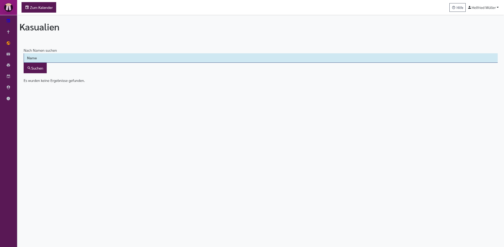

Öffnen Sie die Übersicht über den Menüpunkt **Kasualien**.

Die Seite dient vor allem zum Wiederfinden bereits erfasster Kasualien. Da Kasualdaten verschlüsselt gespeichert werden, kann die Suche länger dauern als andere Listen.

Oben links stehen, abhängig von Ihrer Startseiten-Einstellung:

- **Zum Kalender**: Öffnet den [Kalender](kalender.md).
- **Taufe anlegen...**: Legt eine neue Taufe oder Taufanfrage an und öffnet den Taufeditor.
- **Beerdigung anlegen...**: Öffnet den Assistenten **Bestattung hinzufügen**.
- **Trauung anlegen...**: Öffnet den Assistenten **Trauung hinzufügen**.

Im Inhaltsbereich finden Sie:

- **Nach Namen suchen**: Suchfeld für Namen oder Namensteile. Es durchsucht Taufen, Trauungen und Beerdigungen.
- **Suchen**: Startet die Suche.
- **Suche läuft...**: Hinweis während der Suche. Der Text nennt den gesuchten Begriff.
- **Suchergebnisse**: Ergebnisbereich nach einer Suche.
- **Beerdigungen**, **Taufen**, **Trauungen**: Die Ergebnisse sind nach Kasualart gruppiert. Jede Gruppe zeigt Gottesdienst, Person, Bearbeitungsstand, Dokumente und Bearbeitungsschaltflächen.
- **Es wurden keine Ergebnisse gefunden.**: Dieser Hinweis erscheint, wenn keine passende Kasualie gefunden wurde oder wenn das Suchfeld leer abgeschickt wurde.

In den Ergebnislisten gibt es je nach Kasualie eine Stift-Schaltfläche zum Bearbeiten, eine Papierkorb-Schaltfläche zum Löschen und einen Bereich für Dateien. Dateien lassen sich dort auch per Ziehen in die Liste hochladen.

---

## Kasualien auf der Startseite

Die Startseite kann mehrere Kasualien-Reiter enthalten. Welche Reiter sichtbar sind, stellen Sie in [Persönliche Einstellungen](einstellungen.md) im Bereich **Startseite** ein.

### Reiter Kasualien

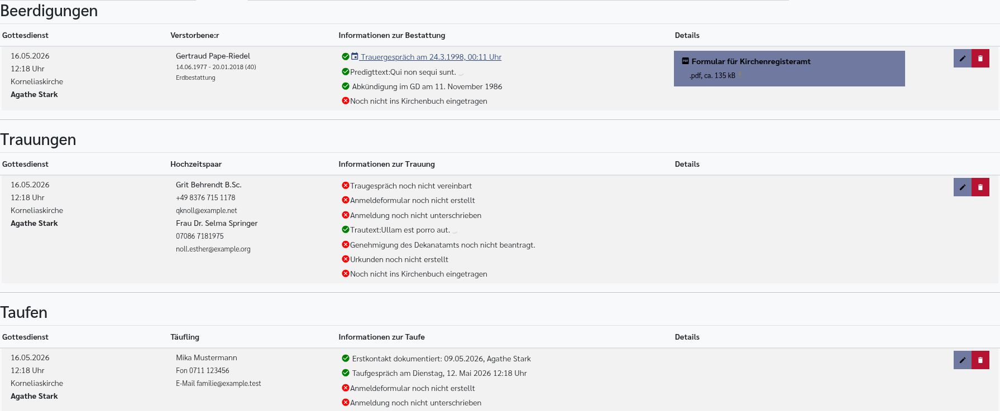

Der Reiter **Kasualien** zeigt drei Abschnitte untereinander:

- **Beerdigungen**
- **Trauungen**
- **Taufen**

Jeder Abschnitt meldet, wenn keine passenden Einträge vorhanden sind. Andernfalls erscheint eine Tabelle mit dem Gottesdienst, der betroffenen Person, dem Vorbereitungsstand, Dateien und Bearbeitungsschaltflächen.

Die Einstellung zu diesem Reiter enthält:

- **Titel**: Überschrift, die auf der Startseite für den Reiter angezeigt wird.
- **Kasualien für folgende Gemeinden anzeigen**: Mehrfachauswahl der Gemeinden. Nur Kasualien aus diesen Gemeinden erscheinen im Reiter.

### Reiter Taufen

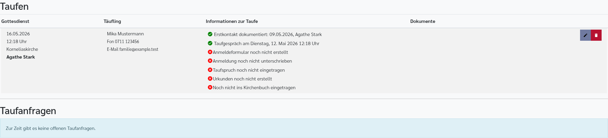

Der Reiter **Taufen** zeigt geplante Taufen und, wenn aktiviert, offene Taufanfragen ohne konkreten Gottesdienst. Bei geplanten Taufen werden Gottesdienst, Täufling, Vorbereitung, Dokumente und Aktionen angezeigt. Taufanfragen erscheinen in einem eigenen Abschnitt **Taufanfragen**.

Die Einstellungen zu diesem Reiter enthalten:

- **Nur meine eigenen Taufen anzeigen**: Zeigt nur Taufen, bei denen Sie selbst beteiligt sind.
- **Taufanfragen anzeigen**: Blendet den Abschnitt mit offenen Taufanfragen ein.
- **Späteste Tauftermine zuerst anzeigen**: Sortiert neuere Termine nach oben.
- **Ins Kirchenbuch eingetragene Taufen ausblenden**: Zeigt nur noch Taufen, bei denen der Kirchenbucheintrag noch offen ist.

### Reiter Beerdigungen

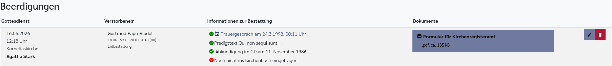

Der Reiter **Beerdigungen** zeigt Bestattungen mit Gottesdienst, verstorbener Person, Vorbereitungsstand, Dokumenten und Aktionen.

Die Einstellungen zu diesem Reiter enthalten:

- **Nur meine eigenen Beerdigungen anzeigen**: Zeigt nur Beerdigungen, bei denen Sie selbst beteiligt sind.
- **Späteste Beerdigungstermine zuerst anzeigen**: Sortiert neuere Termine nach oben.
- **Ins Kirchenbuch eingetragene Beerdigungen ausblenden**: Zeigt nur noch Beerdigungen, bei denen der Kirchenbucheintrag noch offen ist.

### Reiter Trauungen

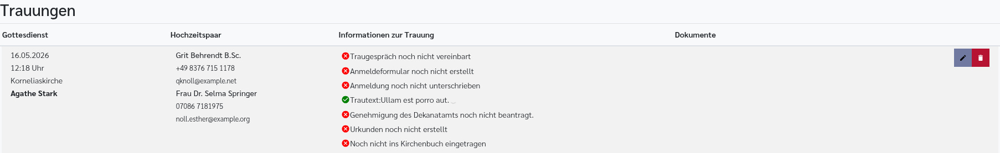

Der Reiter **Trauungen** zeigt Trauungen mit Gottesdienst, Hochzeitspaar, Vorbereitungsstand, Dokumenten und Aktionen.

Die Einstellungen zu diesem Reiter enthalten:

- **Nur meine eigenen Trauungen anzeigen**: Zeigt nur Trauungen, bei denen Sie selbst beteiligt sind.
- **Späteste Trautermine zuerst anzeigen**: Sortiert neuere Termine nach oben.
- **Ins Kirchenbuch eingetragene Trauungen ausblenden**: Zeigt nur noch Trauungen, bei denen der Kirchenbucheintrag noch offen ist.

---

## Kasualien im Editor für Veranstaltungen und Gottesdienste

Öffnen Sie einen Gottesdienst und wechseln Sie zum Reiter **Kasualien**. Dort sehen Sie alle Kasualien, die mit diesem Gottesdienst verbunden sind.

Der Reiter enthält, nur wenn Einträge vorhanden sind:

- **Trauungen**: Liste der Trauungen dieses Gottesdienstes.
- **Taufen**: Liste der Taufen dieses Gottesdienstes.
- **Bestattungen**: Liste der Beerdigungen dieses Gottesdienstes.
- **Für diesen Gottesdienst sind noch keine Kasualien eingetragen.**: Hinweis, wenn keine Kasualien verbunden sind.

Unten stehen drei Schaltflächen:

- **Trauung hinzufügen**: Legt zu diesem Gottesdienst eine Trauung an.
- **Taufe hinzufügen**: Legt zu diesem Gottesdienst eine Taufe an.
- **Bestattung hinzufügen**: Legt zu diesem Gottesdienst eine Beerdigung an.

Diese Schaltflächen verwenden den bereits geöffneten Gottesdienst. Für Trauungen und Beerdigungen ist das der normale Weg, wenn der Gottesdienst schon im Kalender vorhanden ist. Bei Taufen lässt sich eine Taufanfrage auch zuerst ohne Gottesdienst erfassen und später im Feld **Taufgottesdienst** verbinden.

---

## Gemeinsame Listenangaben

In der Kasualien-Übersicht, auf der Startseite und im Editor für Veranstaltungen und Gottesdienste werden Kasualien als Zeilen angezeigt.

Bei einer **Taufe** sehen Sie:

- **Gottesdienst**: Datum, Uhrzeit und Ort, wenn die Taufe mit einem Gottesdienst verbunden ist.
- **Täufling**: Name, Telefon und E-Mailadresse.
- **Erstkontakt**: Ob Erstkontakt dokumentiert ist, mit Datum und Person.
- **Taufgespräch**: Termin, falls eingetragen.
- **Dimissoriale**: Status, falls eine Dimissoriale benötigt wird.
- **Anmeldeformular**: Ob ein Anmeldeformular vorhanden ist.
- **Anmeldung unterschrieben**: Ob die unterschriebene Anmeldung vorliegt.
- **Taufspruch**: Bibelstelle, falls eingetragen.
- **Urkunden**: Ob Urkunden erstellt wurden und wo sie hinterlegt sind.
- **Kirchenbuch**: Ob der Kirchenbucheintrag abgeschlossen ist.
- **Dokumente**: Angehängte Dateien. Neue Dateien lassen sich in diesen Bereich ziehen.
- **Stift**: Taufe bearbeiten.
- **Papierkorb**: Taufe nach Rückfrage löschen.

Bei einer **Beerdigung** sehen Sie:

- **Gottesdienst**: Datum, Uhrzeit und Ort.
- **Verstorbene:r**: Name, Lebensdaten, Alter und Bestattungsart.
- **Trauergespräch**: Termin; über das Kalendersymbol lässt sich der Termin als Kalenderdatei übernehmen.
- **Dimissoriale**: Status, falls eine Dimissoriale benötigt wird.
- **Predigttext**: Bibelstelle, falls eingetragen.
- **Abkündigung**: Datum des Gottesdienstes, in dem abgekündigt wird.
- **Kirchenbuch**: Ob der Kirchenbucheintrag abgeschlossen ist.
- **Dokumente**: Angehängte Dateien und das automatisch angebotene **Formular für Kirchenregisteramt**.
- **Stift**: Bestattung bearbeiten.
- **Papierkorb**: Bestattung nach Rückfrage löschen.

Bei einer **Trauung** sehen Sie:

- **Gottesdienst**: Datum, Uhrzeit und Ort.
- **Hochzeitspaar**: Namen, Telefon und E-Mailadressen.
- **Traugespräch**: Termin, falls eingetragen.
- **Anmeldeformular**: Ob ein Anmeldeformular vorhanden ist.
- **Anmeldung unterschrieben**: Ob die unterschriebene Anmeldung vorliegt.
- **Trautext**: Bibelstelle, falls eingetragen.
- **Dimissoriale**: Status für Partner:in 1 und Partner:in 2, wenn benötigt.
- **Genehmigung vom Dekanatamt**: Status, wenn eine Genehmigung erforderlich ist.
- **Urkunden**: Ob Urkunden erstellt wurden und wo sie hinterlegt sind.
- **Kirchenbuch**: Ob der Kirchenbucheintrag abgeschlossen ist.
- **Dokumente**: Angehängte Dateien.
- **Stift**: Trauung bearbeiten.
- **Papierkorb**: Trauung nach Rückfrage löschen.

---

## Dimissoriale

Eine Dimissoriale ist die Erlaubnis eines anderen Pfarramts, eine Kasualie durchzuführen. Sie wird benötigt, wenn für die Person oder die Personen einer Taufe, Trauung oder Beerdigung eigentlich ein anderes Pfarramt zuständig ist.

Pfarrplaner hilft dabei, diese Erlaubnis nachzuverfolgen: Sie sehen, ob sie benötigt wird, wann sie beantragt wurde und wann sie eingegangen ist.

Bei Taufen und Beerdigungen steht ein gemeinsamer Bereich **Dimissoriale** zur Verfügung:

- **Dimissoriale benötigt**: Aktiviert die weiteren Felder.
- **Zuständiges Pfarramt**: Pfarramt, das die Dimissoriale erteilt.
- **Beantragt**: Datum der Beantragung.
- **Erhalten**: Datum des Eingangs.
- **Link zum automatischen Erteilen des Dimissoriale**: Link, den das zuständige Pfarramt öffnen kann. Das Kopiersymbol neben dem Link erscheint beim Daraufzeigen mit der Maus und kopiert den Link in die Zwischenablage.

Bei Trauungen gibt es diese Angaben getrennt für beide Ehepartner:innen. Zusätzlich zeigt der Trauungseditor eine Genehmigungsprüfung für das Dekanatamt.

---

## Taufen

Taufen unterscheiden sich von Trauungen und Beerdigungen dadurch, dass sie als **Taufanfrage** beginnen dürfen. Das ist für Anfragen gedacht, bei denen noch kein konkreter Tauftermin feststeht. Sobald ein Termin feststeht, soll die Taufe mit einem Taufgottesdienst verbunden werden.

### Taufe anlegen

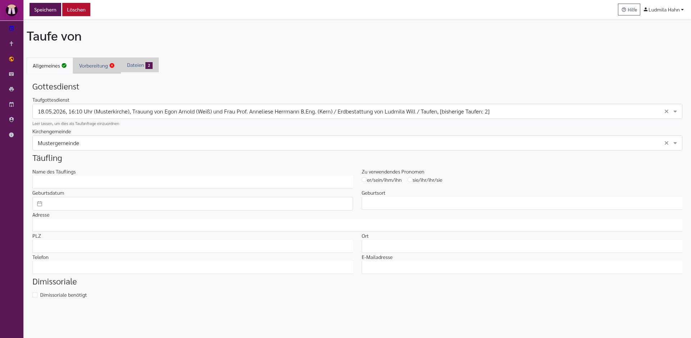

Eine Taufe legen Sie entweder über **Taufe anlegen...** oder im Editor für Veranstaltungen und Gottesdienste über **Taufe hinzufügen** an.

Wenn Sie über **Taufe anlegen...** starten, öffnet sich direkt der Taufeditor. Das Feld **Taufgottesdienst** ist dann leer und zeigt die Auswahl **noch nicht gewählt (Taufanfrage)**. Wählen Sie später den passenden Gottesdienst aus.

Wenn Sie im Editor für Veranstaltungen und Gottesdienste **Taufe hinzufügen** verwenden, ist der geöffnete Gottesdienst bereits eingetragen.

### Taufeditor

Oben im Taufeditor stehen:

- **Speichern**: Speichert alle Änderungen.
- **Löschen**: Löscht die Taufe nach einer Sicherheitsfrage.

Der Taufeditor hat drei Reiter. Kleine Häkchen an Reitern zeigen, ob wichtige Angaben vollständig sind. Die Zählung am Reiter **Dateien** zeigt angehängte und automatisch angebotene Dateien.

### Reiter Allgemeines

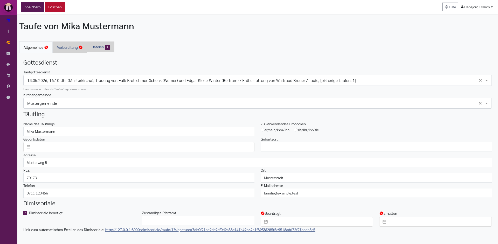

Der Reiter **Allgemeines** enthält die Grunddaten.

Im Bereich **Gottesdienst**:

- **Taufgottesdienst**: Auswahl des zugehörigen Gottesdienstes. Die Liste ist in zwei Gruppen unterteilt: **Taufgottesdienste** (als Taufgottesdienst markierte Termine) und **Andere Gottesdienste** (übrige Gottesdienste). Leer bedeutet: offene Taufanfrage ohne festen Termin.
- **Kirchengemeinde**: Zuständige Gemeinde.

Im Bereich **Täufling**:

- **Name des Täuflings**: Name der zu taufenden Person.
- **Zu verwendendes Pronomen**: Auswahl der Anredeform, die später in Texten verwendet wird.
- **Geburtsdatum**: Datumsauswahl.
- **Geburtsort**: Ort der Geburt.
- **Adresse**: Straße und Hausnummer.
- **PLZ**: Postleitzahl.
- **Ort**: Wohnort.
- **Telefon**: Telefonnummer.
- **E-Mailadresse**: E-Mailadresse.

Darunter folgt der Bereich **Dimissoriale**, wenn eine Dimissoriale zu dokumentieren ist.

### Reiter Vorbereitung

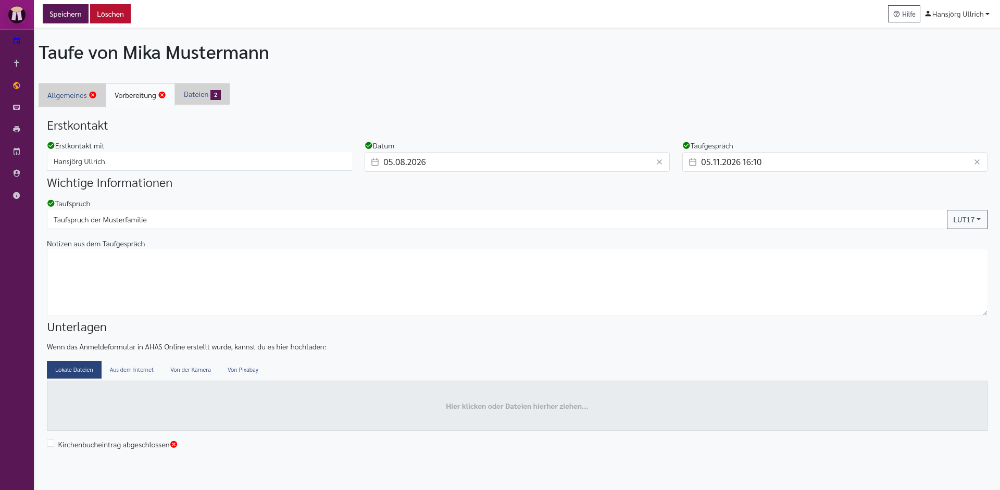

Der Reiter **Vorbereitung** sammelt die Vorbereitung des Taufgesprächs und der Unterlagen.

Im Bereich **Erstkontakt**:

- **Erstkontakt mit**: Person, mit der zuerst gesprochen wurde. Standardmäßig wird Ihr eigener Name eingetragen.
- **Datum**: Datum des Erstkontakts. Standardmäßig ist das aktuelle Datum eingetragen.
- **Taufgespräch**: Datum und Uhrzeit des Taufgesprächs.

Im Bereich **Wichtige Informationen**:

- **Taufspruch**: Bibelstelle für die Taufe.
- **Notizen aus dem Taufgespräch**: Freies Notizfeld für interne Gesprächsnotizen.

Im Bereich **Unterlagen**:

- **Anmeldeformular**: Uploadfeld, solange noch kein Anmeldeformular vorhanden ist. Dieser Upload ist für das in AHAS Online erstellte Anmeldeformular gedacht.
- **Anmeldedaten aufgenommen und Anmeldeformular erstellt**: Statushinweis, sobald ein Anmeldeformular vorhanden ist.
- **Anmeldung unterschrieben**: Markierung, dass die unterschriebene Anmeldung vorliegt.
- **Urkunden erstellt**: Markierung, dass die Urkunden vorbereitet sind.
- **Urkunden hinterlegt**: Ort, an dem die Urkunden liegen.
- **Kirchenbucheintrag abgeschlossen**: Markierung, dass die Taufe ins Kirchenbuch eingetragen wurde.

### Reiter Dateien

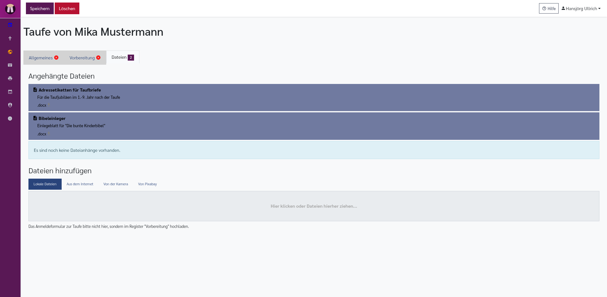

Der Reiter **Dateien** enthält:

- **Angehängte Dateien**: Liste vorhandener Dateien.
- **Automatisch angebotene Dateien**: Vordefinierte Dokumente, falls für Ihre Installation eingerichtet.
- **Dateien hinzufügen**: Uploadfeld für weitere Dateien.

Das Anmeldeformular zur Taufe soll im Reiter **Vorbereitung** hochgeladen werden, nicht im allgemeinen Datei-Reiter.

---

## Trauungen

Eine Trauung wird immer mit einem Gottesdienst verbunden. Wenn Sie den Assistenten **Trauung hinzufügen** verwenden, erstellt Pfarrplaner zuerst den Gottesdienst und verbindet die Trauung sofort damit. Wenn der Gottesdienst schon existiert, verwenden Sie im Editor für Veranstaltungen und Gottesdienste **Trauung hinzufügen**.

### Assistent Trauung hinzufügen

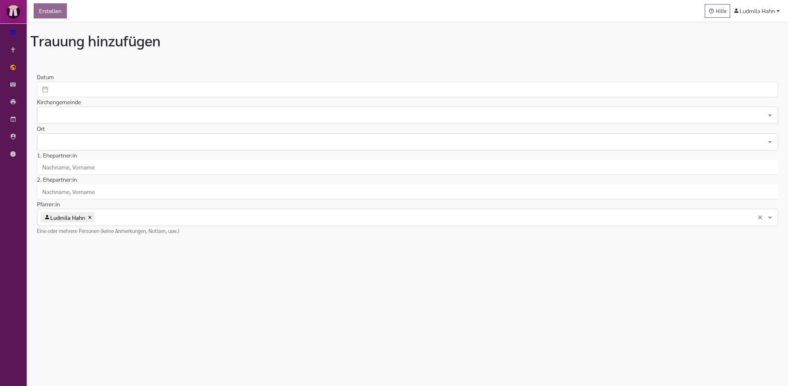

Der Assistent enthält oben die Schaltfläche **Erstellen**. Sie wird erst aktiv, wenn Datum, Kirchengemeinde, Ort und beide Namen ausgefüllt sind.

Felder im Assistenten:

- **Datum**: Datum und Uhrzeit der Trauung.
- **Kirchengemeinde**: Zuständige Gemeinde.
- **Ort**: Kirche oder anderer Ort. Die Ortsauswahl verwendet die Orte der gewählten Gemeinde; ein besonderer Ort kann als Text eingetragen werden.
- **1. Ehepartner:in**: Name im Format **Nachname, Vorname**.
- **2. Ehepartner:in**: Name im Format **Nachname, Vorname**.
- **Pfarrer:in**: Auswahl der beteiligten Person. Je nach Bezeichnung Ihrer Installation kann dieses Feld anders heißen.

Nach **Erstellen** öffnet sich der Trauungseditor.

### Trauungseditor

Oben im Trauungseditor stehen:

- **Speichern**: Speichert alle Änderungen.
- **Löschen**: Löscht die Trauung nach einer Sicherheitsfrage.

Der Editor hat die Reiter **Brautpaar**, **Vorbereitung** und **Dateien**.

### Reiter Brautpaar

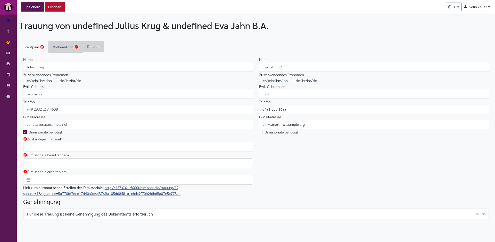

Der Reiter **Brautpaar** zeigt zwei gleich aufgebaute Spalten, eine für jede Person.

Je Person gibt es:

- **Name**: Name der Person.
- **Zu verwendendes Pronomen**: Anredeform für Texte.
- **Evtl. Geburtsname**: Geburtsname, falls abweichend.
- **Telefon**: Telefonnummer.
- **E-Mailadresse**: E-Mailadresse.
- **Dimissoriale benötigt**: Aktiviert die Dimissorialfelder für diese Person.
- **Zuständiges Pfarramt**: Erscheint nur, wenn eine Dimissoriale benötigt wird.
- **Dimissoriale beantragt am**: Erscheint nur, wenn eine Dimissoriale benötigt wird.
- **Dimissoriale erhalten am**: Erscheint nur, wenn eine Dimissoriale benötigt wird.
- **Link zum automatischen Erteilen des Dimissoriale**: Erscheint nur, wenn eine Dimissoriale benötigt wird.

Im Bereich **Genehmigung**:

- **Genehmigungs-Auswahl**: Wählen Sie, ob keine Genehmigung erforderlich ist oder warum eine Genehmigung des Dekanatamts erforderlich ist.
- **Genehmigung beantragt**: Erscheint, wenn eine Genehmigung erforderlich ist.
- **Genehmigung erhalten**: Erscheint, wenn eine Genehmigung erforderlich ist.

Zur Auswahl stehen:

- **Für diese Trauung ist keine Genehmigung des Dekanatamts erforderlich**
- **Für diese Trauung ist eine Genehmigung des Dekanatamts erforderlich, weil ein Ehegatte keiner Kirche oder Religionsgemeinschaft angehört. (§5 Abs. 2b TrauO)**
- **Für diese Trauung ist eine Genehmigung des Dekanatamts erforderlich, weil mindestens ein Ehegatte geschieden ist. (§7 Abs. 2b TrauO)**
- **Für diese Trauung ist eine Genehmigung des Dekanatamts aus anderen Gründen erforderlich.**

### Reiter Vorbereitung

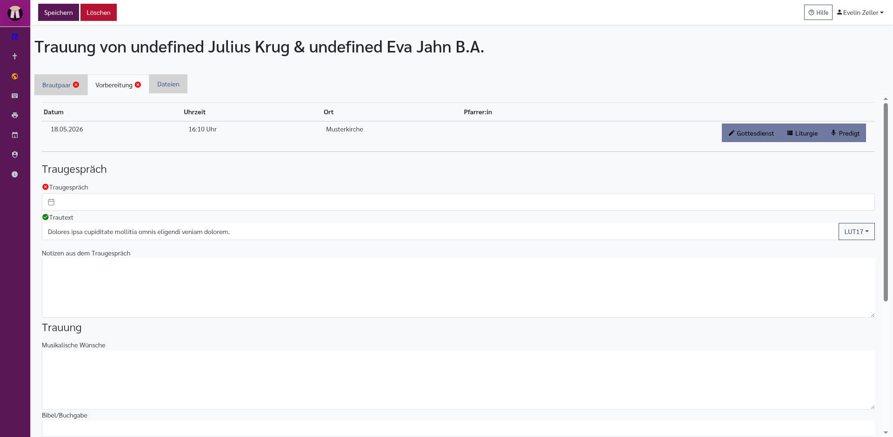

Oben zeigt der Reiter den verbundenen Gottesdienst:

- **Datum**
- **Uhrzeit**
- **Ort**
- **Pfarrer:in**
- **Gottesdienst**: Öffnet den Editor für Veranstaltungen und Gottesdienste.
- **Liturgie**: Öffnet den Liturgie-Editor.
- **Predigt**: Öffnet den Predigteditor.

Im Bereich **Traugespräch**:

- **Traugespräch**: Datum und Uhrzeit.
- **Trautext**: Bibelstelle für die Trauung.
- **Notizen aus dem Traugespräch**: Interne Notizen.

Im Bereich **Trauung**:

- **Musikalische Wünsche**: Wünsche zu Musik und Liedern.
- **Bibel/Buchgabe**: Vermerk zur Gabe.
- **Blumenschmuck**: Absprachen zum Schmuck.

Im Bereich **Unterlagen**:

- **Format der Urkunde**: Auswahl zwischen **Urkunde klein (für Familienstammbuch)** und **Urkunde A4**.
- **Anmeldeformular**: Uploadfeld, solange noch kein Anmeldeformular vorhanden ist.
- **Anmeldedaten aufgenommen und Anmeldeformular erstellt**: Statushinweis, sobald ein Anmeldeformular vorhanden ist.
- **Anmeldung unterschrieben**: Markierung, dass die unterschriebene Anmeldung vorliegt.
- **Urkunden erstellt**: Markierung, dass die Urkunden vorbereitet sind.
- **Urkunden hinterlegt**: Ort, an dem die Urkunden liegen.
- **Kirchenbucheintrag abgeschlossen**: Markierung, dass die Trauung ins Kirchenbuch eingetragen wurde.

### Reiter Dateien

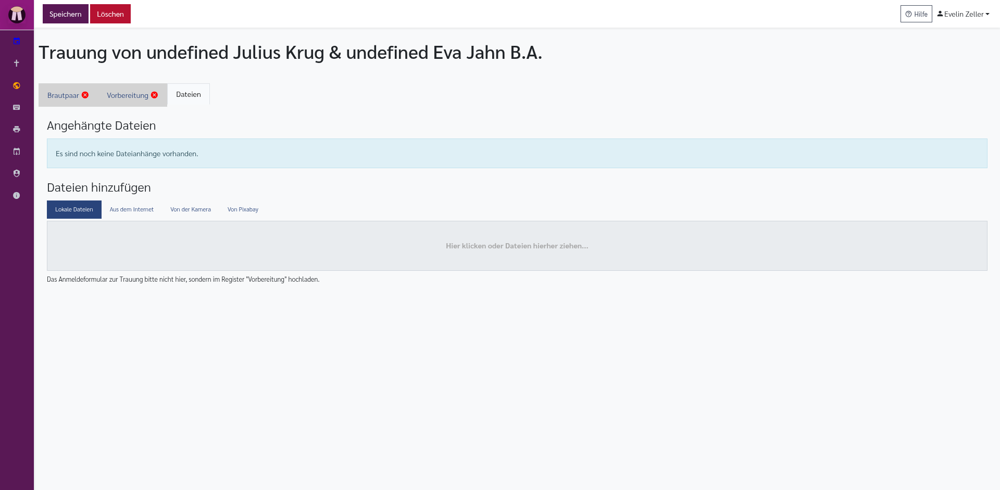

Der Reiter **Dateien** enthält:

- **Angehängte Dateien**: Liste vorhandener Dateien.
- **Dateien hinzufügen**: Uploadfeld für weitere Dateien.

Das Anmeldeformular zur Trauung soll im Reiter **Vorbereitung** hochgeladen werden.

---

## Beerdigungen

Eine Beerdigung wird immer mit einem Gottesdienst verbunden. Wenn Sie den Assistenten **Bestattung hinzufügen** verwenden, erstellt Pfarrplaner zuerst den Gottesdienst und verbindet die Beerdigung sofort damit. Wenn der Gottesdienst schon existiert, verwenden Sie im Editor für Veranstaltungen und Gottesdienste **Bestattung hinzufügen**.

### Assistent Bestattung hinzufügen

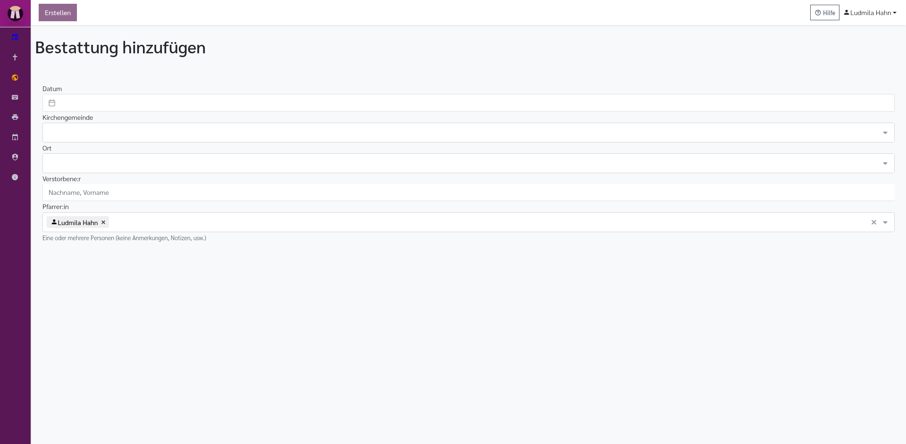

Der Assistent enthält oben die Schaltfläche **Erstellen**. Sie wird erst aktiv, wenn Datum, Kirchengemeinde, Ort und Name der verstorbenen Person ausgefüllt sind.

Felder im Assistenten:

- **Datum**: Datum und Uhrzeit der Bestattung.
- **Kirchengemeinde**: Zuständige Gemeinde.
- **Ort**: Friedhof, Kirche oder anderer Ort. Die Ortsauswahl verwendet die Orte der gewählten Gemeinde; ein besonderer Ort kann als Text eingetragen werden.
- **Verstorbene:r**: Name im Format **Nachname, Vorname**.
- **Pfarrer:in**: Auswahl der Person, die die Bestattung leitet. Je nach Bezeichnung Ihrer Installation kann dieses Feld anders heißen.

Wenn Sie Poolmaster:in sind, erscheint nach Auswahl eines Datums zusätzlich ein Pool-Bereich:

- **Pool "...“**: Name des Pools.
- **Poolmaster:in von ... bis ...**: Zeitraum Ihrer Poolmaster-Zuständigkeit.
- **Name**: Kolleg:in aus dem Pool, mit Telefon und E-Mailadresse, falls vorhanden.
- **Vorhandene Dienste**: Bereits eingetragene Gottesdienste dieser Person im Zeitraum.
- **Abwesenheiten**: Urlaub oder andere Abwesenheiten aus dem [Urlaubsplan](urlaubsplan.md).
- **Übernehmen**: Trägt diese Person in das Feld **Pfarrer:in** ein.

Nach **Erstellen** öffnet sich der Beerdigungseditor.

### Beerdigungseditor

Oben im Beerdigungseditor stehen:

- **Speichern**: Speichert alle Änderungen.
- **Löschen**: Löscht die Beerdigung nach einer Sicherheitsfrage.
- **Weitere Aktionen**: Öffnet zusätzliche Sicherungsfunktionen.
- **Datenpaket im Browser sichern**: Speichert eine Kopie dieses Beerdigungsdatensatzes im Browser.
- **Datenpaket auf Festplatte sichern**: Lädt die Daten als JSON-Datei herunter.

Wenn im Browser eine Sicherung vorhanden ist, erscheint oberhalb des Editors ein Hinweis:

- **Wiederherstellen**: Übernimmt die zwischengespeicherte Kopie in den Editor.
- **Löschen**: Entfernt die Browser-Kopie.

Der Editor hat die Reiter **Allgemeines**, **Bestattung**, **Angehörige**, **Trauergespräch** und **Dateien**.

### Reiter Allgemeines

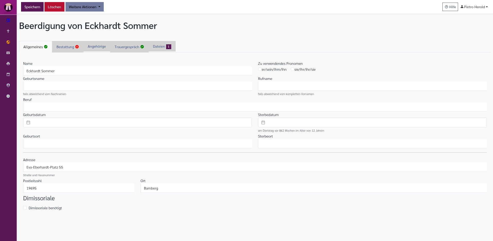

Der Reiter **Allgemeines** enthält die Grunddaten der verstorbenen Person.

- **Name**: Name im Format **Nachname, Vorname**.
- **Zu verwendendes Pronomen**: Anredeform für Texte.
- **Geburtsname**: Falls abweichend vom Nachnamen.
- **Rufname**: Falls der gebräuchliche Rufname vom vollständigen Vornamen abweicht.
- **Beruf**: Beruf der verstorbenen Person.
- **Geburtsdatum**: Datumsauswahl.
- **Sterbedatum**: Datumsauswahl. Der Editor zeigt dazu Hinweise wie Sterbealter, wenn Geburts- und Sterbedatum vorhanden sind.
- **Geburtsort**: Ort der Geburt.
- **Sterbeort**: Ort des Todes.
- **Adresse**: Straße und Hausnummer.
- **Postleitzahl**: PLZ.
- **Ort**: Wohnort.
- **Dimissoriale**: Dokumentation einer nötigen Dimissoriale.

### Reiter Bestattung

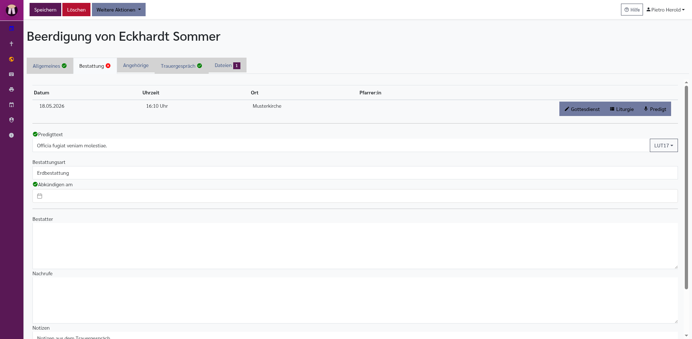

Oben zeigt der Reiter den verbundenen Gottesdienst:

- **Datum**
- **Uhrzeit**
- **Ort**
- **Pfarrer:in**
- **Gottesdienst**: Öffnet den Editor für Veranstaltungen und Gottesdienste.
- **Liturgie**: Öffnet den Liturgie-Editor.
- **Predigt**: Öffnet den Predigteditor.

Darunter stehen:

- **Predigttext**: Bibelstelle für die Bestattung.
- **Von Predigt übernehmen**: Erscheint nur, wenn im verbundenen Predigteditor bereits eine Bibelstelle eingetragen ist. Die Schaltfläche übernimmt diese Bibelstelle als Predigttext der Beerdigung.
- **Bestattungsart**: Auswahl zwischen **Erdbestattung**, **Trauerfeier**, **Trauerfeier mit Urnenbeisetzung** und **Urnenbeisetzung**.
- **Datum der vorhergehenden Trauerfeier**: Erscheint nur bei **Urnenbeisetzung**.
- **Ort der vorhergehenden Trauerfeier**: Erscheint nur bei **Urnenbeisetzung**.
- **Abkündigen am**: Datum des Gottesdienstes, in dem die Abkündigung erfolgen soll.
- **Bestatter**: Freies Textfeld für Bestatter und Absprachen.
- **Nachrufe**: Freies Textfeld für Nachrufe.
- **Notizen**: Interne Notizen.
- **Kirchenbucheintrag abgeschlossen**: Markierung, dass die Beerdigung ins Kirchenbuch eingetragen wurde.

### Reiter Angehörige

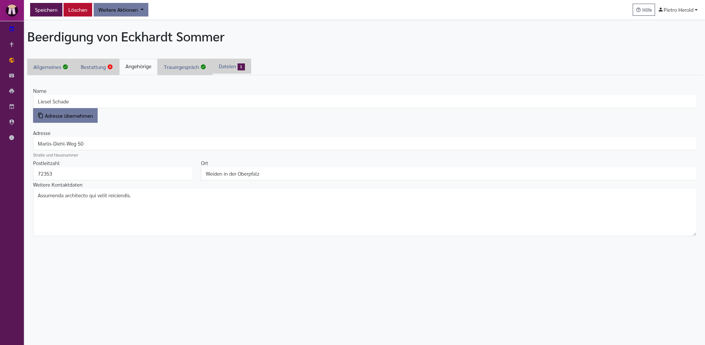

Der Reiter **Angehörige** sammelt die wichtigste Kontaktperson.

- **Name**: Name der angehörigen Person.
- **Adresse übernehmen**: Übernimmt Adresse, Postleitzahl und Ort der verstorbenen Person.
- **Adresse**: Straße und Hausnummer.
- **Postleitzahl**: PLZ.
- **Ort**: Wohnort.
- **Weitere Kontaktdaten**: Telefon, E-Mail oder weitere Hinweise.

### Reiter Trauergespräch

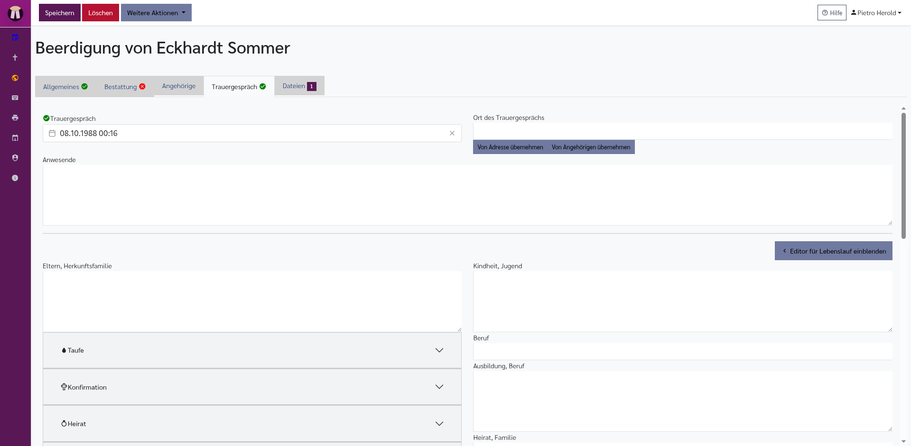

Der Reiter **Trauergespräch** dient zur ausführlichen Dokumentation des Trauergesprächs. Die vielen Felder sind nicht als Pflichtprogramm gedacht, sondern als strukturierte Gesprächsnotizen: Sie helfen, Lebensdaten, Erinnerungen, Familieninformationen, Bibelstellen und Formulierungen für Ansprache, Lebenslauf und Predigt festzuhalten.

Oben stehen:

- **Trauergespräch**: Datum und Uhrzeit des Gesprächs.
- **Ort des Trauergesprächs**: Adresse oder Ort.
- **Von Adresse übernehmen**: Übernimmt die Adresse der verstorbenen Person als Gesprächsort.
- **Von Angehörigen übernehmen**: Übernimmt die Adresse der angehörigen Person als Gesprächsort.
- **Anwesende**: Personen, die beim Trauergespräch dabei waren.

Wenn Bilddateien an der Beerdigung hängen, erscheint auf größeren Bildschirmen:

- **Angehängte Bilder**: Vorschau der Bilddateien. Das hilft, Fotos oder Dokumente beim Gespräch und beim Schreiben im Blick zu behalten.

Danach folgt die Lebenslauf-Dokumentation:

- **Editor für Lebenslauf einblenden**: Öffnet rechts einen zusätzlichen Texteditor für einen zusammenhängenden Lebenslauf.
- **Editor für Lebenslauf ausblenden**: Blendet diesen Texteditor wieder aus.
- **Eltern, Herkunftsfamilie**: Angaben zur Herkunft.

Im aufklappbaren Bereich **Taufe**:

- **Taufe**: Freies Textfeld zur Taufe.
- **Taufdatum**: Datum der Taufe. Der Editor zeigt, wie alt die Person zu diesem Zeitpunkt war, wenn das Geburtsdatum bekannt ist.

Im aufklappbaren Bereich **Konfirmation**:

- **Konfirmation**: Freies Textfeld.
- **Datum der Konfirmation**: Datum mit Alters-Hinweis.
- **Denkspruch**: Bibelstelle der Konfirmation.

Im aufklappbaren Bereich **Heirat**:

- **Ehepartner:in**: Name oder Angaben zur Ehe.
- **Heiratsdatum**: Datum der Hochzeit. Der Editor zeigt die Dauer der Ehe, wenn die nötigen Daten vorhanden sind.
- **Trauspruch**: Bibelstelle der Trauung.
- **Sterbedatum Ehepartner:in**: Datum, falls die Ehepartnerin oder der Ehepartner bereits verstorben ist.

Im aufklappbaren Bereich **Familie**:

- **Kinder**: Angaben zu Kindern.
- **Weitere Hinterbliebene**: Weitere Familienangehörige oder nahestehende Personen.

Weitere Gesprächsfelder:

- **Kindheit, Jugend**
- **Beruf**: Dasselbe Berufsfeld wie im Reiter **Allgemeines**.
- **Ausbildung, Beruf**
- **Heirat, Familie**
- **Weiterer Lebenslauf**
- **Lebensende**: Der Editor zeigt als Hilfe eine Zusammenfassung aus Sterbedatum, Sterbeort, Alter und Lebenstagen, soweit diese Angaben vorhanden sind.
- **Prägende Erlebnisse, Hobbies, Interessen**
- **Charakter**
- **Glaube, Frömmigkeit, Kirche**
- **Zitate**

Wenn der Lebenslauf-Editor eingeblendet ist, gibt es zusätzlich:

- **Lebenslauf**: Rich-Text-Feld für einen zusammenhängenden Textentwurf.
- **B**: Markiert Text fett.
- **I**: Markiert Text kursiv.
- **U**: Unterstreicht Text.
- **H1**: Formatiert als Überschrift.
- **Zitat**: Formatiert als Zitat.
- **1.**: Erstellt eine nummerierte Liste.
- **Aufzählungspunkt**: Erstellt eine Aufzählung.
- **Formatierung entfernen**: Entfernt Formatierungen aus der aktuellen Auswahl.
- **Texte**: Fügt Textbausteine aus den vorhandenen Beerdigungsdaten ein, zum Beispiel Geburtsdatum, Sterbedatum, Geburtsort, Sterbeort, Geburtsname, Rufname oder Sterbealter.
- **Textstatistik**: Zeigt Angaben zum Text, zum Beispiel Umfang.

### Reiter Dateien

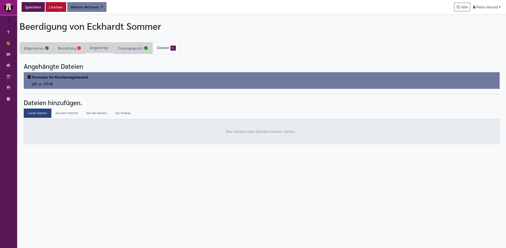

Der Reiter **Dateien** enthält:

- **Angehängte Dateien**: Liste vorhandener Dateien.
- **Formular für Kirchenregisteramt**: Automatisch angebotenes PDF.
- **Dateien hinzufügen**: Uploadfeld für weitere Dateien.

---

## Löschen

In den Editoren und Listen gibt es eine Papierkorb- oder **Löschen**-Schaltfläche. Vor dem Löschen fragt Pfarrplaner nach, ob die Kasualie wirklich unwiderruflich gelöscht werden soll.

> **Achtung:** Beim Löschen wird nur die Kasualie gelöscht. Prüfen Sie anschließend den verbundenen Gottesdienst, wenn auch der Gottesdienst nicht mehr gebraucht wird.

> **Achtung:** Wenn Sie dagegen den verbundenen Gottesdienst löschen, werden auch alle damit verbundenen Taufen, Trauungen und Beerdigungen gelöscht. Prüfen Sie deshalb vor dem Löschen eines Gottesdienstes immer den Reiter **Kasualien**.

---

## Verwandte Kapitel

- [Startseite](startseite.md): Kasualien-Reiter und Schnellschaltflächen einrichten
- [Kalender](kalender.md): Kasualien im Kalender erkennen
- [Veranstaltungen und Gottesdienste](veranstaltungen.md): Gottesdienst bearbeiten und Reiter **Kasualien** nutzen
- [Liturgie-Editor](liturgie.md): Ablauf für Taufe, Trauung oder Beerdigung bearbeiten
- [Predigteditor](predigt.md): Predigt und Leseansicht nutzen
- [Urlaubsplan](urlaubsplan.md): Abwesenheiten im Bestattungsassistenten berücksichtigen
- [Berichte und Ausgaben](berichte.md): Listen, Formulare und Ausgaben erstellen
