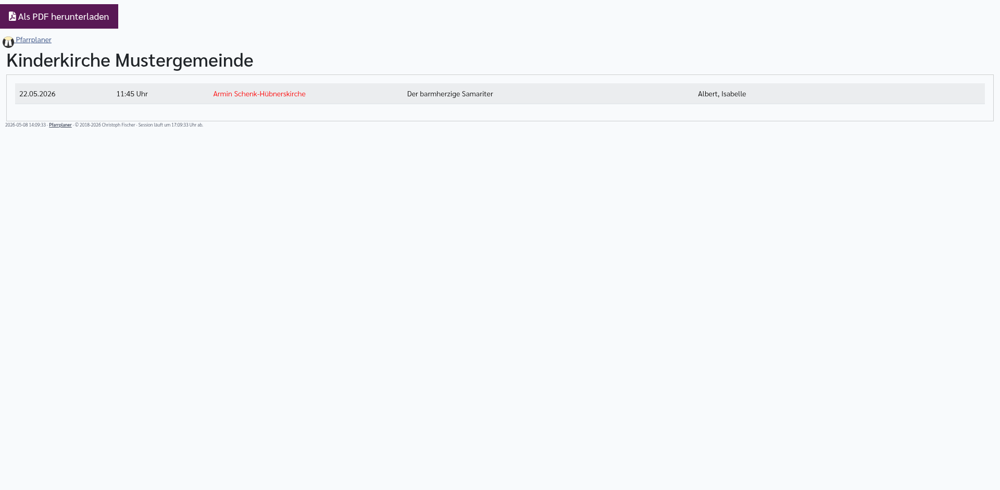
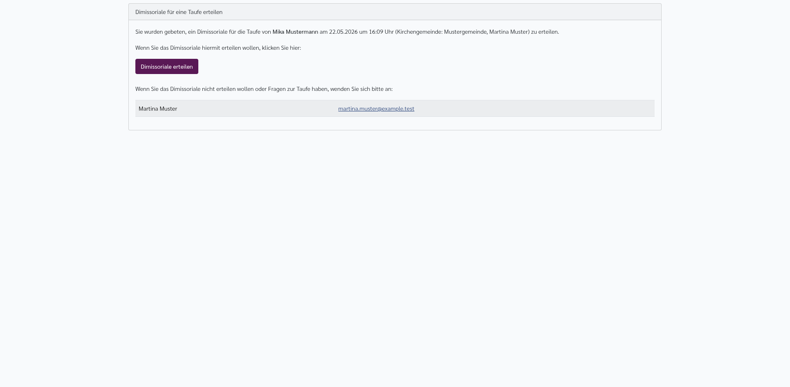
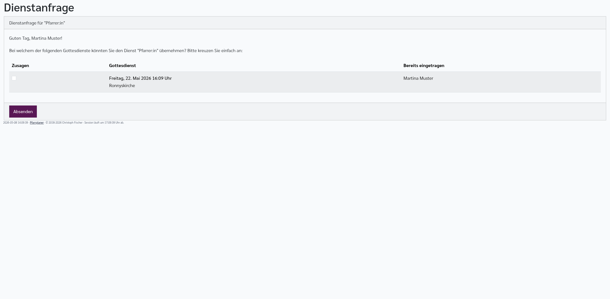
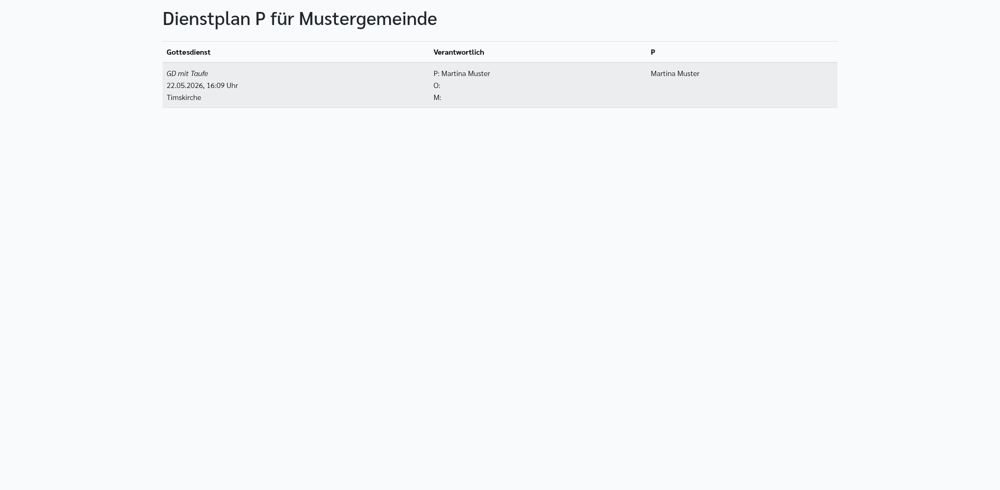

[//]: # (TOC: 15. Öffentliche Seiten und Freigabelinks)

# Öffentliche Seiten und Freigabelinks

Pfarrplaner stellt einige Seiten ohne normale Anmeldung bereit. Solche Seiten sind für externe Personen gedacht, zum Beispiel Bestatter, Mitarbeitende mit einer Dienstanfrage oder ein anderes Pfarramt, das eine Dimissoriale erteilt.

Öffentliche Links sollten nur gezielt weitergegeben werden. Manche Links sind zusätzlich signiert. Dann kann die Seite nur über genau diesen Link geöffnet werden.

---

## Öffentliche Pool-Übersicht

Die öffentliche Pool-Übersicht wird über einen Pool-Link geöffnet. Sie heißt **Ansprechpartner für: ...** und zeigt für den jeweiligen Pool die erreichbaren Pfarrpersonen und Vertretungen für den kommenden Zeitraum.

Die Ansicht enthält:

- **Zeitraum**: Heute bis etwa einen Monat in die Zukunft.
- **Kirchengemeinden**: Jede Gemeinde des Pools bekommt einen eigenen Abschnitt.
- **Pfarrpersonen**: Name und, falls gepflegt, Amt, Telefon und E-Mailadresse.
- **Abwesenheiten**: Zeitraum und Vertretung.
- **Poolmaster:in "...“**: Hinweis, wenn die Vertretung über eine Poolmaster-Zuständigkeit kommt.
- **Abwesend; eine Vertretung wurde bisher nicht angegeben.**: Hinweis, wenn noch keine Vertretung eingetragen ist.

Diese Seite ist besonders für Bestatter hilfreich. Details stehen im Kapitel [Urlaubsplan](urlaubsplan.md).

---

## Öffentliche Kinderkirche-Seite

Die öffentliche Kinderkirche-Seite wird für eine Gemeinde geöffnet. Sie zeigt Kinderkirche-Termine dieser Gemeinde.

Die Seite enthält:

- **Als PDF herunterladen**: Lädt dieselbe Übersicht als PDF.
- **Datum**
- **Uhrzeit**
- **Ort**: Wird rot angezeigt, wenn der Kinderkirch-Ort vom Standard abweicht.
- **Thema oder Lektion**
- **Mitarbeitende**
- **In dem angegebenen Zeitraum wurden keine Termine für die Kinderkirche gefunden.**: Hinweis, wenn keine Termine vorhanden sind.

Die PDF-Version wird aus denselben Daten erstellt.

---

## Öffentliche Dimissoriale-Seite

Die Dimissoriale-Seite wird über einen signierten Link geöffnet. Sie ist für externe Pfarrämter gedacht, die eine Dimissoriale für eine Taufe, Trauung oder Beerdigung erteilen sollen.

Die Seite enthält:

- **Dimissoriale für eine ... erteilen**: Überschrift mit der Kasualart.
- **Kasualienangaben**: Name des Täuflings, der verstorbenen Person oder des Hochzeitspaars.
- **Gottesdienstangaben**: Datum, Uhrzeit, Kirchengemeinde und zuständige Pfarrperson, wenn ein Gottesdienst verbunden ist.
- **Dimissoriale erteilen**: Schaltfläche, mit der die Dimissoriale bestätigt wird.
- **Kontaktliste**: Pfarrpersonen des Gottesdienstes mit Telefon- und E-Maillinks, falls gepflegt.

Wenn die Dimissoriale bereits erteilt wurde, zeigt die Seite, dass nichts mehr zu tun ist. Nach dem Erteilen erscheint eine Dankeseite mit denselben Kontaktangaben.

---

## Öffentliche Dienstanfrage

Eine Dienstanfrage wird über einen signierten Link geöffnet. Sie fragt eine bestimmte Person, ob sie einen bestimmten Dienst in einem oder mehreren Gottesdiensten übernehmen kann.

Die Seite enthält:

- **Dienstanfrage für "...“**: Name des Dienstes.
- **Begrüßung**: Name der angefragten Person.
- **Zusagen**: Kontrollkästchen je Gottesdienst.
- **Gottesdienst**: Datum, Uhrzeit und Ort.
- **Bereits eingetragen**: Personen, die für diesen Dienst schon eingetragen sind.
- **Absenden**: Speichert die ausgewählten Zusagen.

Nach dem Absenden erscheint eine Dankeseite. Wenn beim Erstellen der Anfrage eine absendende Person hinterlegt wurde, erhält diese eine Nachricht über die Zusage.

---

## Öffentlicher Dienstplan

Der öffentliche Dienstplan zeigt Dienste einer Gemeinde für eine oder mehrere Dienstkategorien.

Die Seite enthält:

- **Dienstplan ... für ...**: Überschrift mit Dienstkategorien und Gemeinde.
- **Gottesdienst**: Titel, Datum, Uhrzeit und Ort.
- **Verantwortlich**: Pfarrer:in, Organist:in und Mesner:in, soweit eingetragen.
- **Dienst-Spalten**: Eine Spalte je angeforderter Dienstkategorie.

Es werden kommende Gottesdienste angezeigt, bei denen Personen in den ausgewählten Dienstkategorien eingetragen sind.

---

## Nächster Stream

Der öffentliche Link für den nächsten Stream zeigt keine eigene Pfarrplaner-Seite. Er sucht den nächsten Gottesdienst mit YouTube-Link in den angegebenen Gemeinden und leitet direkt zu YouTube weiter.

Wenn kein künftiger Stream gefunden wird, verwendet Pfarrplaner den letzten vorhandenen Stream. Gibt es gar keinen Stream, erscheint eine Fehlerseite.

---

## Verwandte Kapitel

- [Urlaubsplan](urlaubsplan.md): Öffentliche Pool-Übersicht für Bestatter
- [Berichte und Ausgaben](berichte.md): HTML-Code für Websites erstellen
- [Kasualien](kasualien.md): Dimissoriale im Zusammenhang mit Kasualien
- [Veranstaltungen und Gottesdienste](veranstaltungen.md): Kinderkirche, Dienste und Streamingdaten pflegen
