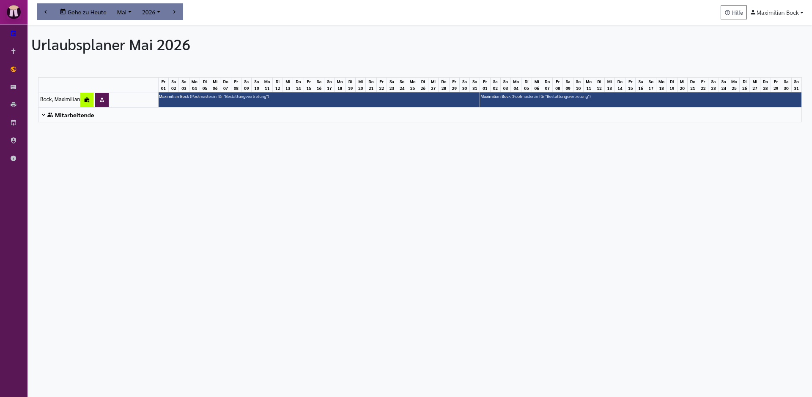
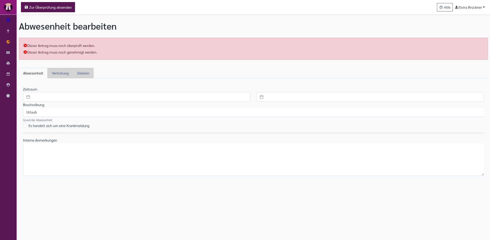
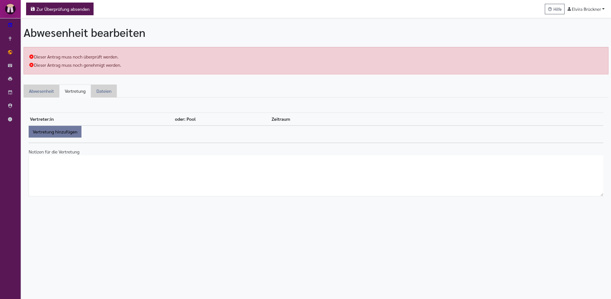
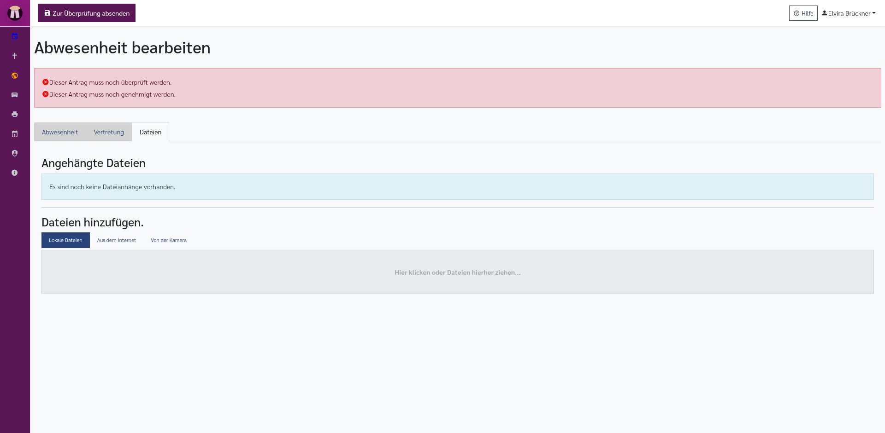
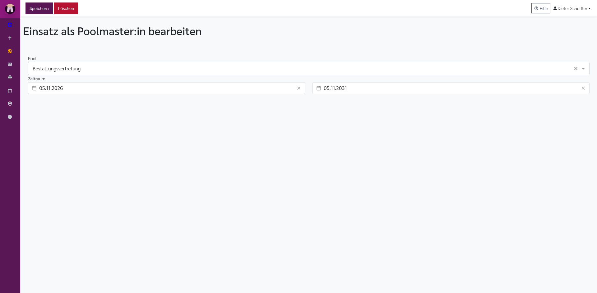
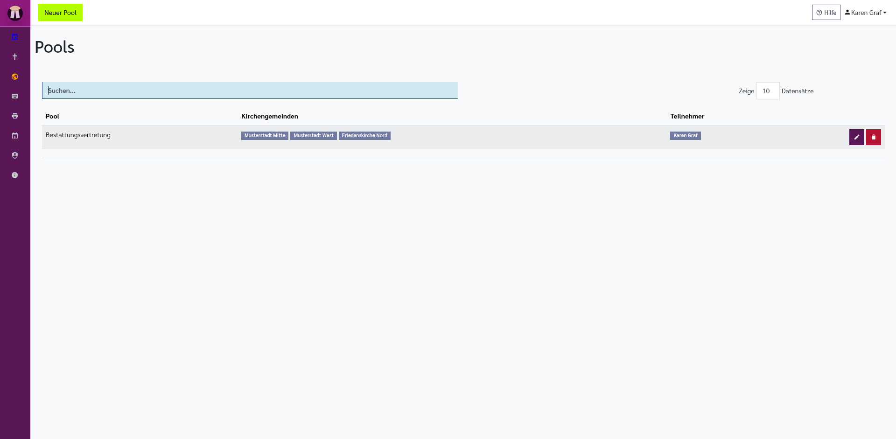
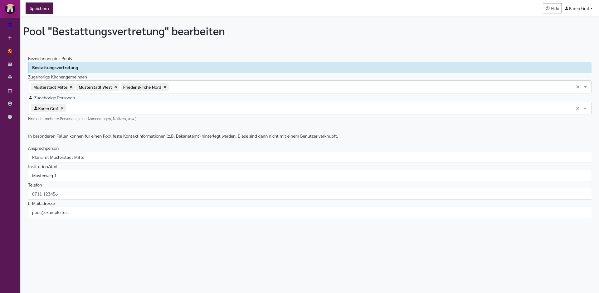
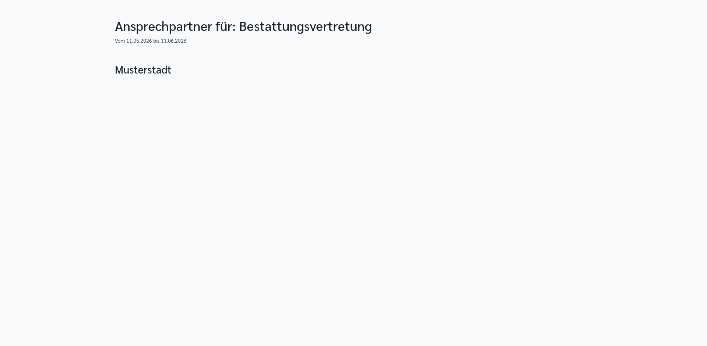

[//]: # (TOC: 10. Urlaubsplan)

# Urlaubsplan

Der Urlaubsplan zeigt Urlaub, Krankheit, Fortbildung und andere Abwesenheiten. Er hilft dabei, Gottesdienste, Kasualien und Vertretungen so zu planen, dass früh sichtbar ist, wer nicht verfügbar ist und wer eine Vertretung übernimmt.

Der Urlaubsplan ist nicht nur eine persönliche Urlaubsliste. Er verbindet mehrere Dinge miteinander:

- Abwesenheiten von Personen
- Vertretungen für ganze Zeiträume oder Teilzeiträume
- Prüf- und Genehmigungsverfahren für Urlaubsanträge
- Poolmaster-Zeiten
- Hinweise im [Kalender](kalender.md), im [Editor für Veranstaltungen und Gottesdienste](veranstaltungen.md) und bei [Kasualien](kasualien.md)

Tragen Sie nur Informationen ein, die für die Planung nötig sind. Medizinische Einzelheiten gehören nicht in allgemein sichtbare Felder.

---

## Was ist ein Pool?

Ein **Pool** ist eine Gruppe von Personen, die gemeinsam für Vertretungen zuständig sein kann. Ein Pool wird in der Administration angelegt und einer oder mehreren Kirchengemeinden zugeordnet. Außerdem werden Personen hinzugefügt, die zu diesem Pool gehören.

Ein typisches Beispiel: Mehrere Pfarrer:innen eines Distrikts bilden einen Vertretungspool. Wenn jemand Urlaub hat, kann für den Urlaub als Vertretung nicht nur eine einzelne Person, sondern ein Pool eingetragen werden. Pfarrplaner kann dann anzeigen, welche Poolmaster:innen im Zeitraum zuständig sind.

Ein Pool wird verwendet für:

- Vertretungsregelungen bei Abwesenheiten
- Anzeige von Poolmaster-Zeiten im Urlaubsplan
- Unterstützung im Bestattungsassistenten, wenn eine zuständige Person gesucht wird
- Kontaktangaben für Vertretungslisten und Berichte

Ein Pool kann entweder über Benutzer:innen arbeiten oder feste Kontaktangaben haben. Feste Kontaktangaben sind für Sonderfälle gedacht, zum Beispiel wenn ein Dekanatamt als zentrale Kontaktstelle angegeben werden soll.

---

## Was ist ein:e Poolmaster:in?

Ein:e **Poolmaster:in** ist für einen Pool in einem bestimmten Zeitraum zuständig. Diese Zuständigkeit ist kein Urlaub, wird aber im Urlaubsplan als eigener dunkler Eintrag angezeigt. Dadurch ist sichtbar, wer für Pool-Anfragen erreichbar ist.

Poolmaster-Zeiten werden auch für Vertretungen genutzt: Wenn bei einer Abwesenheit ein Pool als Vertretung eingetragen ist, kann Pfarrplaner für den Zeitraum die zuständigen Poolmaster:innen anzeigen. Hat der Pool feste Kontaktangaben, werden stattdessen diese Kontaktdaten verwendet.

---

## Urlaubsplan aufrufen

Öffnen Sie den Urlaubsplan über den Menüpunkt **Urlaub**. Die Seite heißt oben **Urlaubsplaner** und zeigt den gewählten Monat.

Oben links befindet sich die Monatsnavigation:

- **Pfeil nach links**: Einen Monat zurück. Diese Schaltfläche erscheint erst ab Februar 2018.
- **Gehe zu Heute**: Öffnet den aktuellen Monat.
- **Monatsauswahl**: Öffnet die Monate Januar bis Dezember.
- **Jahresauswahl**: Öffnet die verfügbaren Jahre.
- **Pfeil nach rechts**: Einen Monat weiter.

Beim Öffnen lädt Pfarrplaner zuerst die Benutzer:innen und danach die Einträge je Person. Währenddessen erscheinen Hinweise wie **Lade anzuzeigende Benutzer...** oder **Lade Einträge für ... Benutzer...**.

---

## Aufbau des Urlaubsplans

Der Urlaubsplan ist eine Tabelle. Links stehen die Personen, oben die Tage des Monats. Jede Zelle steht für einen Tag.

Die Benutzer:innen sind in Bereiche gegliedert:

- **Eigenes Konto**: Ihr eigener Eintrag.
- **Pfarrer:innen**: Pfarrpersonen, falls Ihre Installation diese Bezeichnung verwendet und Sie diese Personen sehen dürfen.
- **Mitarbeitende**: Weitere Personen, deren Abwesenheiten sichtbar sind.
- **Ausgeblendete Mitarbeitende**: Personen, die nicht dauerhaft im Hauptbereich angezeigt werden.

Klicken Sie auf die Überschrift eines Bereichs, um ihn ein- oder auszuklappen. Pfarrplaner merkt sich diese Einstellung für Ihr Konto.

Bei Mitarbeitenden können Augensymbole erscheinen:

- **Auge**: Die Person wird dauerhaft im Bereich **Mitarbeitende** angezeigt. Klicken Sie darauf, um sie auszublenden.
- **Durchgestrichenes Auge**: Die Person steht unter **Ausgeblendete Mitarbeitende**. Klicken Sie darauf, um sie wieder dauerhaft einzublenden.

Diese Augensymbole erscheinen für Pfarrpersonen bei Mitarbeitenden, deren Urlaub nicht ohnehin im Gottesdienstplaner angezeigt wird.

---

## Farben und Einträge lesen

Die Tabelle nutzt Farben und Hinweise:

| Markierung | Bedeutung |
|---|---|
|  **Normale Tageszelle** | Kein besonderer Eintrag. |
|  **Sonntag** | Rötlich markierter Sonntag. |
|  **Ferientag oder Feiertagszeit** | Grünlich markierter besonderer Zeitraum. |
|  **Abwesenheit** | Genehmigte oder direkt gespeicherte Abwesenheit. |
|  **Wartet auf Prüfung oder Genehmigung** | Antrag ist noch im Genehmigungsverfahren. |
|  **Krankmeldung** | Krankmeldung, wenn Sie den Eintrag bearbeiten oder sehen dürfen. |
|  **Vertretung** | Sie selbst sind als Vertretung eingetragen. |
|  **Poolmaster:in** | Poolmaster-Zuständigkeit. |

In einem Abwesenheitsfeld stehen Name, Beschreibung und, falls vorhanden, die Vertretung mit **V:**. Wenn Sie die Maus über den Eintrag halten, zeigt Pfarrplaner zusätzliche Informationen wie Zeitraum, Vertretung und Status an.

Ein Eintrag ist anklickbar, wenn Sie ihn bearbeiten dürfen. Leere Tage sind anklickbar, wenn Sie für diese Person einen Eintrag anlegen dürfen.

---

## Abwesenheit anlegen

Sie können eine Abwesenheit auf zwei Arten anlegen:

- Klicken Sie in einer bearbeitbaren Zeile auf die Schaltfläche **Neuen Urlaubseintrag hinzufügen**.
- Klicken Sie auf einen leeren Tag in einer bearbeitbaren Zeile.

Die Schaltfläche **Neuen Urlaubseintrag hinzufügen** zeigt ein Aktenkoffer-Symbol mit Plus. Sie erscheint nur bei Personen, für die Sie Einträge anlegen dürfen.

Beim Anlegen wird zunächst ein neuer Eintrag mit der Beschreibung **Urlaub** erstellt und anschließend der Editor geöffnet. Der Zeitraum beginnt mit dem gewählten Tag.

---

## Abwesenheitseditor

Der Editor heißt **Abwesenheit bearbeiten**. Welche Schaltflächen oben sichtbar sind, hängt davon ab, welche Rolle Sie in diesem Vorgang haben und wie der Genehmigungsprozess für die betroffene Person eingerichtet ist.

Mögliche Schaltflächen oben:

- **Zur Überprüfung absenden**: Speichert den Antrag und sendet ihn in den Prüfprozess.
- **Speichern**: Speichert den Eintrag direkt. Diese Schaltfläche erscheint bei Selbstverwaltung.
- **Zur Genehmigung weiterleiten**: Markiert den Antrag als geprüft und leitet ihn weiter.
- **Genehmigen**: Genehmigt den Antrag.
- **Erneut überprüfen lassen**: Gibt einen Antrag aus der Genehmigung zurück in die Prüfung.
- **Ablehnen**: Lehnt den Antrag ab. Dabei kann eine Ablehnungsnachricht an Beteiligte gesendet werden.
- **Löschen**: Löscht den Eintrag, wenn Sie löschen dürfen.

Über dem Formular erscheint bei Anträgen im Genehmigungsverfahren ein Statusbereich. Dort sehen Sie, ob der Antrag bereits überprüft oder genehmigt wurde, durch wen und wann.

---

## Reiter Abwesenheit

Der Reiter **Abwesenheit** enthält die Grunddaten.

- **Zeitraum**: Zwei Datumsfelder. Links steht der erste Tag, rechts der letzte Tag der Abwesenheit.
- **Beschreibung**: Grund der Abwesenheit, zum Beispiel **Urlaub**, **Fortbildung** oder **Krank**.
- **Es handelt sich um eine Krankmeldung**: Markierung für Krankmeldungen. Krankmeldungen werden im Plan gesondert eingefärbt, sofern Sie den Eintrag sehen oder bearbeiten dürfen.
- **Interne Anmerkungen**: Freies Feld für interne Hinweise.

Bei Selbstverwaltung können zusätzlich erscheinen:

- **Von der zuständigen Stelle genehmigt**: Markierung, dass die Genehmigung bereits außerhalb des Pfarrplaners vorliegt.
- **Datum der Genehmigung**: Erscheint, wenn die Markierung **Von der zuständigen Stelle genehmigt** aktiv ist.

Wenn Sie als prüfende Person arbeiten, kann im Statusbereich erscheinen:

- **Bemerkungen zur Überprüfung**: Notizfeld für Hinweise an die genehmigende Person.

Wenn Sie als genehmigende Person arbeiten, kann im Statusbereich erscheinen:

- **Bemerkungen zur Genehmigung**: Notizfeld für Hinweise zur Entscheidung.

---

## Reiter Vertretung

Der Reiter **Vertretung** erscheint nur, wenn für die betroffene Person in der Administration **Urlaubsvertretung benötigt** aktiviert ist.

In diesem Reiter planen Sie, wer den Dienst während der Abwesenheit übernimmt. Eine Abwesenheit kann mehrere Vertretungszeilen haben. Das ist nützlich, wenn verschiedene Zeitabschnitte unterschiedlich vertreten werden.

Die Tabelle **Vertreten durch** enthält:

- **Vertreter:in**: Auswahl einer oder mehrerer Personen.
- **oder: Pool**: Auswahl eines Pools. Damit wird nicht eine einzelne Person, sondern die zuständige Pool-Struktur verwendet.
- **Zeitraum**: Zeitraum dieser Vertretungszeile. Der Zeitraum soll innerhalb der Abwesenheit liegen; beim Speichern wird er auf den Abwesenheitszeitraum begrenzt.
- **Papierkorb**: Entfernt diese Vertretungszeile.

Unter der Tabelle steht:

- **Vertretung hinzufügen**: Fügt eine weitere Vertretungszeile hinzu.
- **Notizen für die Vertretung**: Hinweise, die bei der Vertretung angezeigt werden, zum Beispiel Schlüssel, Absprachen oder besondere Erreichbarkeit.

Wenn in einer Vertretungszeile ein Pool gewählt ist, wertet Pfarrplaner später die Poolmaster:innen oder die festen Kontaktangaben des Pools aus.

---

## Reiter Dateien

Der Reiter **Dateien** enthält:

- **Angehängte Dateien**: Liste bereits gespeicherter Dateien.
- **Dateien hinzufügen**: Uploadfeld für weitere Dateien.

Dateien können zum Beispiel ein unterschriebener Urlaubsantrag oder ein Formular sein. Achten Sie bei sensiblen Dokumenten darauf, ob sie wirklich im Pfarrplaner gespeichert werden sollen.

---

## Genehmigungsverfahren

Das Genehmigungsverfahren wird pro Benutzer:in in der Administration eingerichtet. Öffnen Sie dazu **Administration → Benutzer**, bearbeiten Sie die Person und wechseln Sie zum Reiter **Urlaub**.

Dort gibt es diese Einstellungen:

- **Urlaub für diesen Benutzer verwalten**: Aktiviert die Urlaubsverwaltung für diese Person. Erst dann erscheinen die weiteren Urlaubseinstellungen.
- **Urlaub im Gottesdienstplaner anzeigen**: Abwesenheiten dieser Person erscheinen auch im Gottesdienstplaner und in Kalenderhinweisen.
- **Urlaubsvertretung benötigt**: Aktiviert den Reiter **Vertretung** im Abwesenheitseditor.
- **Urlaub muss durch eine der folgenden Personen geprüft werden**: Legt die Personen fest, die Anträge prüfen.
- **Urlaub muss durch eine der folgenden Personen genehmigt werden**: Legt die Personen fest, die Anträge genehmigen.

Pfarrplaner kennt damit drei praktische Verfahren:

### Selbstverwaltung

Wenn für eine Person keine prüfenden und keine genehmigenden Personen eingetragen sind, verwaltet sie die eigenen Abwesenheiten selbst. Im Editor erscheint dann **Speichern**. Falls die Genehmigung außerhalb des Pfarrplaners erfolgt ist, kann **Von der zuständigen Stelle genehmigt** mit Datum dokumentiert werden.

### Prüfung und Genehmigung

Wenn prüfende und genehmigende Personen eingetragen sind, läuft der Antrag in zwei Schritten:

1. Die antragstellende Person sendet die Abwesenheit **Zur Überprüfung**.
2. Eine prüfende Person kontrolliert Zeitraum, Angaben und Vertretung und leitet den Antrag **Zur Genehmigung** weiter.
3. Eine genehmigende Person genehmigt den Antrag oder gibt ihn zur erneuten Prüfung zurück.

In der Startseite kann dafür der Reiter **Urlaubsanträge** aktiviert werden. Dort sehen prüfende und genehmigende Personen ihre offenen Aufgaben.

### Prüfung ohne sichtbare Genehmigungsaufgabe

Wenn nur prüfende Personen eingerichtet sind, kann ein Antrag zumindest geprüft und weiterbearbeitet werden. Ob danach noch eine separate Genehmigung nötig ist, hängt von der örtlichen Praxis ab. Tragen Sie in der Administration Genehmigungspersonen ein, wenn die Genehmigung im Pfarrplaner sichtbar abgeschlossen werden soll.

---

## Startseite: Mein Urlaub

Der Startseiten-Reiter **Mein Urlaub** zeigt Ihre eigenen Urlaubseinträge, Vertretungen und Poolmaster-Zeiten.

Oben gibt es:

- **Urlaubskalender öffnen**: Öffnet den Urlaubsplaner.

Im Abschnitt **Urlaub / Abwesenheit** sehen Sie:

- **Zeitraum**
- **Beschreibung**
- **Vertretung**
- **Hinweise**, wenn Vertretungsnotizen vorhanden sind.
- **Stift**: Öffnet den Eintrag zum Bearbeiten.
- **Download-Menü**: Öffnet Dokumente.
- **Urlaubsantrag**: Erstellt den Bericht **Urlaubsantrag**.
- **Dienstreiseantrag**: Erstellt den Bericht **Dienstreiseantrag**.

Diese beiden Formulare sind für Pfarrer:innen gedacht und erscheinen deshalb nur, wenn Ihr Konto die entsprechende Rolle hat. Die Formulare verwenden Ihre eigenen zukünftigen Abwesenheitseinträge.

Im Abschnitt **Vertretungen** sehen Sie Abwesenheiten anderer Personen, bei denen Sie als Vertretung eingetragen sind:

- **Zeitraum**
- **Vertretung für**
- **Vertretungsregelung**
- **Hinweise**, wenn vorhanden.

Wenn Sie zu Pools gehören, kann zusätzlich der Abschnitt **Poolmaster:in** erscheinen:

- **Zeitraum**
- **Pool**

Wenn keine Einträge vorhanden sind, zeigt der Reiter entsprechende Hinweise.

---

## Startseite: Urlaubsanträge

Der Startseiten-Reiter **Urlaubsanträge** ist für Personen gedacht, die Anträge prüfen oder genehmigen.

Oben gibt es:

- **Urlaubskalender öffnen**: Öffnet den Urlaubsplaner.

Wenn keine Aufgaben vorhanden sind, erscheint ein Hinweis. Sonst gibt es zwei mögliche Abschnitte.

Im Abschnitt **Zur Überprüfung** sehen prüfende Personen:

- **Benutzer**: Person, die den Antrag gestellt hat, mit Änderungsdatum.
- **Beschreibung**: Grund und Zeitraum.
- **Als überprüft markieren**: Häkchen-Schaltfläche, die den Antrag direkt als überprüft markiert.
- **Zur Überprüfung des Antrags**: Stift-Schaltfläche, öffnet den Editor.
- **Antrag kommentarlos löschen**: Papierkorb-Schaltfläche, löscht den Antrag ohne Kommentar.

Im Abschnitt **Zur Genehmigung** sehen genehmigende Personen:

- **Benutzer**
- **Beschreibung**
- **Status**: Zeigt, wann und durch wen geprüft wurde.
- **Als genehmigt markieren**: Häkchen-Schaltfläche, genehmigt direkt.
- **Zur Genehmigung des Antrags**: Stift-Schaltfläche, öffnet den Editor.

---

## Poolmaster:in werden

Im Urlaubsplan kann neben einer bearbeitbaren Person die Schaltfläche **Poolmaster:in werden** erscheinen. Sie ist an einem Person-mit-Krawatte-Symbol zu erkennen und erscheint nur, wenn Pools vorhanden sind.

Die Schaltfläche öffnet den Editor **Poolmaster:in werden**.

Felder im Poolmaster-Editor:

- **Pool**: Auswahl des Pools.
- **Zeitraum**: Beginn und Ende der Poolmaster-Zuständigkeit.
- **Speichern**: Speichert den Einsatz.
- **Löschen**: Löscht den Einsatz. Bei einem neuen, noch nicht gespeicherten Einsatz führt die Schaltfläche zurück.

Ein gespeicherter Poolmaster-Einsatz erscheint im Urlaubsplan als dunkelblauer Eintrag. Wenn Sie ihn bearbeiten dürfen, können Sie ihn anklicken.

---

## Poolverwaltung in der Administration

Pools werden in der Administration gepflegt. Öffnen Sie **Administration → Vertretungs-Pools** oder den entsprechenden Administrationspunkt Ihrer Installation.

### Pool-Übersicht

Die Übersicht heißt **Pools**.

Sie enthält:

- **Neuer Pool**: Legt einen neuen Pool an, wenn Sie dazu berechtigt sind.
- **Pool-Liste**: Zeigt die vorhandenen Pools.
- **Kirchengemeinden**: Gemeinden, denen der Pool zugeordnet ist.
- **Teilnehmer**: Personen, die zum Pool gehören.

### Pool bearbeiten

Der Pool-Editor heißt entweder **Neuen Pool anlegen** oder **Pool "...“ bearbeiten**.

Oben steht:

- **Speichern**: Speichert den Pool.

Felder im Pool-Editor:

- **Bezeichnung des Pools**: Name des Pools, zum Beispiel **Distrikt Nord** oder **Bestattungsvertretung Bezirk**.
- **Zugehörige Kirchengemeinden**: Gemeinden, für die dieser Pool gilt.
- **Zugehörige Personen**: Personen, die zum Pool gehören.
- **Ansprechperson**: Feste Kontaktperson, wenn der Pool nicht über einzelne Benutzer:innen aufgelöst werden soll.
- **Institution/Amt**: Stelle oder Amt, zum Beispiel **Dekanatamt**.
- **Telefon**: Telefonnummer der festen Kontaktstelle.
- **E-Mailadresse**: E-Mailadresse der festen Kontaktstelle.

Die festen Kontaktinformationen sind Sonderfälle. Wenn sie ausgefüllt sind, können Vertretungen auf diese Kontaktstelle verweisen, auch wenn keine konkrete Benutzer:in im Pfarrplaner ausgewählt wird.

---

## Öffentliche Pool-Übersicht für Bestatter

Für einen Pool kann es eine öffentlich erreichbare Übersicht geben. Diese Seite ist besonders für Bestatter gedacht, die schnell sehen müssen, welche Pfarrperson oder welche Vertretung in den nächsten Wochen ansprechbar ist.

Die öffentliche Seite heißt **Ansprechpartner für: ...** und zeigt den Namen des Pools. Darunter steht der Zeitraum. Der Zeitraum beginnt am heutigen Tag und reicht ungefähr einen Monat in die Zukunft.

Die Seite ist nach Kirchengemeinden gruppiert. Für jede Gemeinde erscheint eine Tabelle.

Pro Pfarrperson sehen Sie:

- **Name**: Name der Pfarrperson.
- **Amt oder Dienststelle**: Erscheint, wenn im Benutzerkonto ein Amt eingetragen ist.
- **Telefon**: Erscheint, wenn eine Telefonnummer eingetragen ist.
- **E-Mail**: Erscheint, wenn eine E-Mailadresse eingetragen ist.
- **Abwesenheiten im Zeitraum**: Wenn die Person abwesend ist, erscheinen Zeitraum und Vertretung.

Bei einer Abwesenheit zeigt die rechte Spalte:

- **Zeitraum**: Zeitraum der Abwesenheit oder des Vertretungsabschnitts.
- **Vertretung**: Name und Kontaktdaten der Vertretung.
- **Poolmaster:in "...“**: Hinweis, wenn die Vertretung über eine Poolmaster-Zuständigkeit ermittelt wurde.
- **Abwesend; eine Vertretung wurde bisher nicht angegeben.**: Hinweis, wenn für den Zeitraum noch keine Vertretung eingetragen ist.

Wenn beim Pool feste Kontaktangaben hinterlegt sind, können diese statt einer konkreten Person erscheinen. Das ist zum Beispiel sinnvoll, wenn Bestatter immer eine zentrale Stelle kontaktieren sollen.

Diese öffentliche Übersicht zeigt nur die Informationen, die für die Erreichbarkeit nötig sind. Pflegen Sie deshalb Telefonnummern, E-Mailadressen, Abwesenheiten, Vertretungen und Poolmaster-Zeiten sorgfältig.

Weitere öffentliche Links sind im Kapitel [Öffentliche Seiten und Freigabelinks](oeffentliche-seiten.md) beschrieben.

---

## Darstellung im Kalender und in anderen Bereichen

Abwesenheiten können im [Kalender](kalender.md) und im Gottesdienstplaner sichtbar werden. Entscheidend ist die Benutzereinstellung **Urlaub im Gottesdienstplaner anzeigen**.

Im Kalender erscheinen Abwesenheiten im Tageskopf. Bei Gottesdiensten und Kasualien helfen sie zu erkennen, ob eingeteilte Personen verfügbar sind.

Bei Beerdigungen unterstützt der Bestattungsassistent Poolmaster:innen zusätzlich: Wenn Sie Poolmaster:in sind, kann der Assistent verfügbare Kolleg:innen, deren Dienste und deren Abwesenheiten anzeigen.

---

## Verwandte Kapitel

- [Startseite](startseite.md): Reiter **Mein Urlaub** und **Urlaubsanträge** aktivieren
- [Kalender](kalender.md): Abwesenheiten neben Gottesdiensten sehen
- [Veranstaltungen und Gottesdienste](veranstaltungen.md): Mitwirkende planen und Abwesenheiten beachten
- [Kasualien](kasualien.md): Verfügbarkeit bei Beerdigungen und anderen Amtshandlungen berücksichtigen
- [Administration](administration.md): Benutzer, Genehmigungswege und Pools einrichten
- [Berichte und Ausgaben](berichte.md): Urlaubsantrag und Dienstreiseantrag erstellen
- [Öffentliche Seiten und Freigabelinks](oeffentliche-seiten.md): Öffentliche Pool-Übersicht und weitere Freigabelinks verstehen
