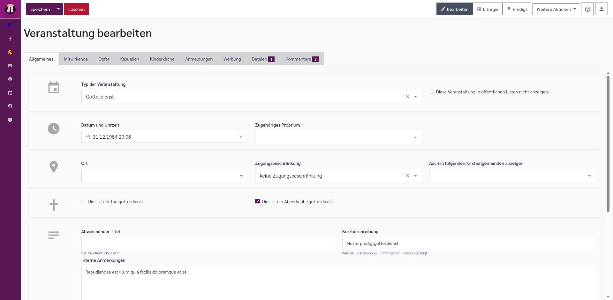
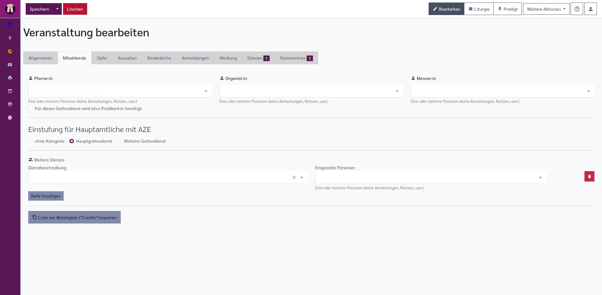
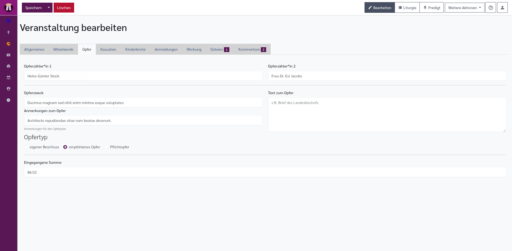
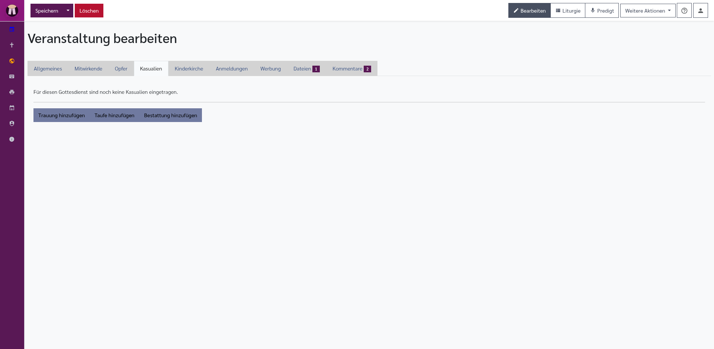
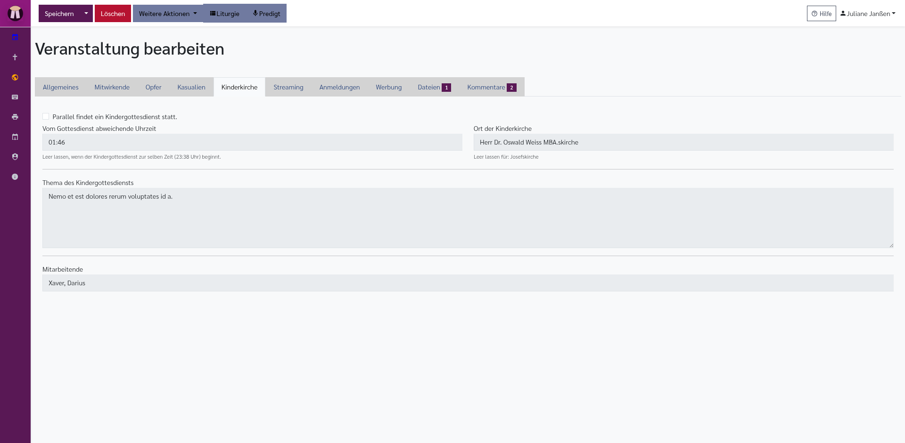
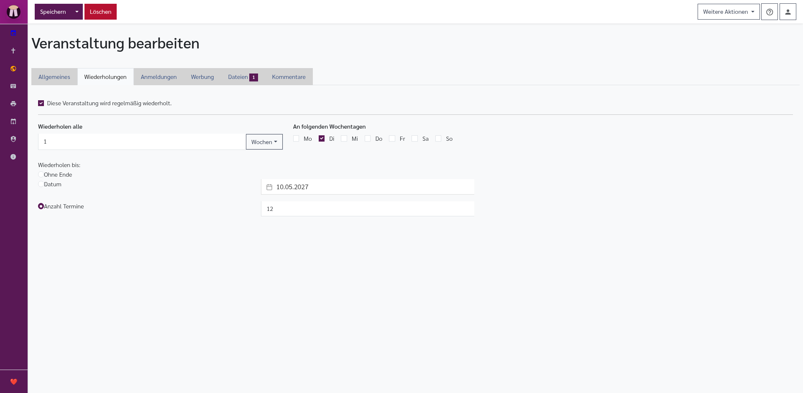
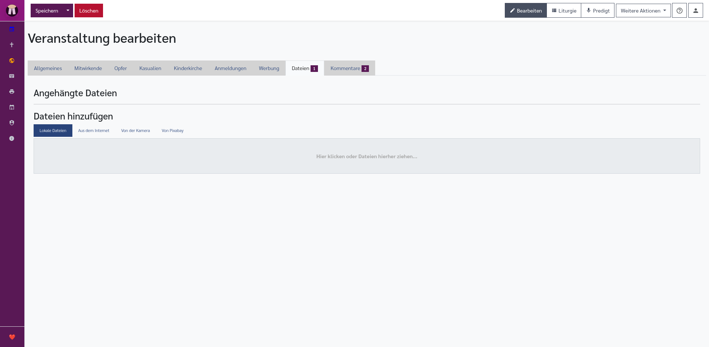
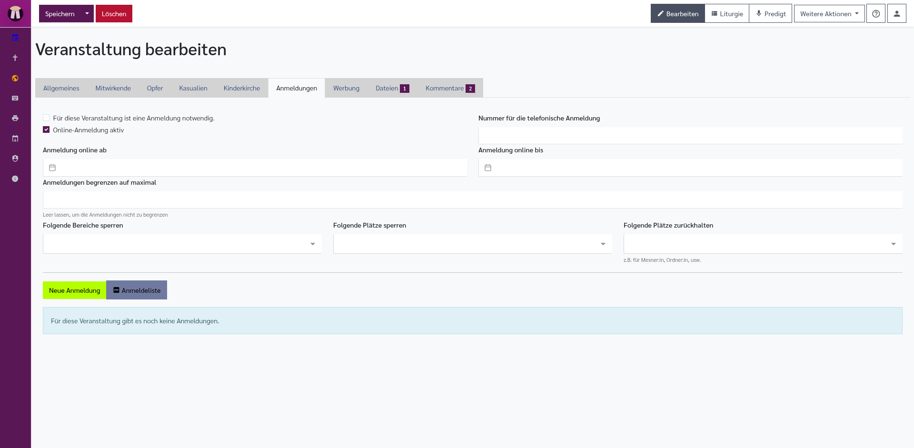
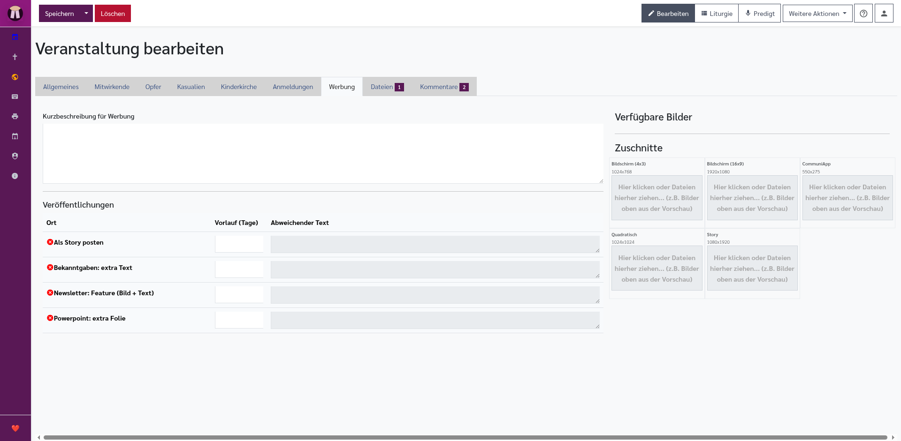
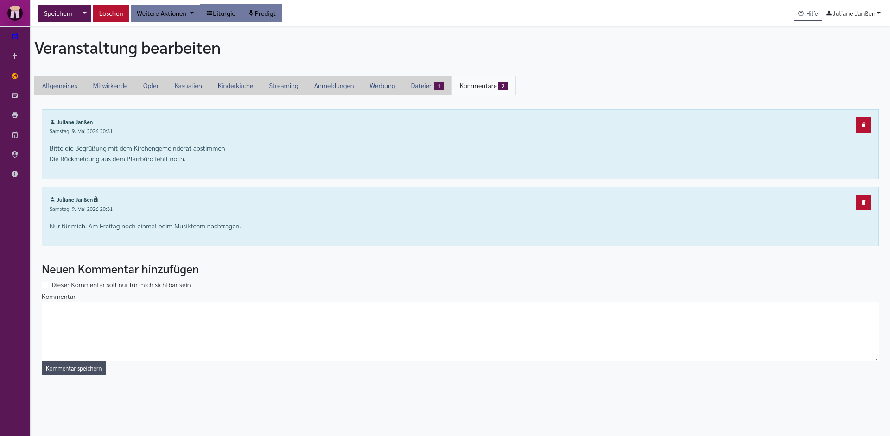

[//]: # (TOC: 6. Veranstaltungen und Gottesdienste)

# Veranstaltungen und Gottesdienste

Der Editor für Veranstaltungen und Gottesdienste ist das Herzstück von Pfarrplaner. Hier erfassen und bearbeiten Sie alle Angaben zu einem Gottesdienst oder einer kirchlichen Veranstaltung.

Ein Eintrag im Editor für Veranstaltungen und Gottesdienste ist die Grundlage für Kalender, Dienstpläne, Ankündigungen, Liedblätter, Statistiken und viele Berichte. Tragen Sie deshalb möglichst alle bekannten Angaben ein. Interne Notizen bleiben intern; öffentliche Texte können später für Gemeindebrief, Website oder Aushang verwendet werden.

---

## Gottesdienste und Veranstaltungen

Pfarrplaner unterscheidet zwischen **Gottesdiensten** und **anderen Veranstaltungen**.

- **Gottesdienste** sind Termine, die für Gottesdienstplanung, Dienstpläne, Liturgie, Predigt, Kasualien, Opfer, Abkündigungen und viele Berichte verwendet werden.
- **Veranstaltungen** sind andere Termine einer Gemeinde, zum Beispiel Gruppen, Sitzungen, Proben oder besondere Aktionen. Sie erscheinen im Veranstaltungskalender und können ebenfalls beschrieben, beworben und mit Dateien ergänzt werden.

Beide Arten werden im selben Editor bearbeitet. Welche Reiter und Felder sichtbar sind, hängt davon ab, ob der Eintrag ein Gottesdienst oder eine andere Veranstaltung ist.

---

## Neuen Eintrag anlegen

Sie können einen neuen Eintrag auf zwei Wegen anlegen:

- Im **Gottesdienstkalender** auf **Gottesdienst anlegen** klicken.
- Im **Veranstaltungskalender** auf **Veranstaltung anlegen** klicken.

Es öffnet sich ein Assistent bzw. der Editor für Veranstaltungen und Gottesdienste. Je nach Einstiegspunkt sind Datum, Gemeinde und Art des Eintrags bereits vorausgefüllt.

---

## Vorhandenen Eintrag öffnen

Klicken Sie im Kalender auf einen bestehenden Gottesdienst oder eine bestehende Veranstaltung, um den Eintrag im Editor zu öffnen.

Wenn Sie einen Eintrag nicht öffnen können, haben Sie möglicherweise nur Leserechte. In diesem Fall sehen Sie den Termin im Kalender, können ihn aber nicht verändern.

---

## Der Editor für Veranstaltungen und Gottesdienste

Der Editor ist in **Reiter** (Tabs) aufgeteilt. Je nach Art des Eintrags und Ihren Rechten sehen Sie zum Beispiel **Allgemeines**, **Mitwirkende**, **Opfer**, **Kasualien**, **Kinderkirche**, **Streaming**, **Anmeldungen**, **Werbung**, **Dateien** und **Kommentare**.

Oben im Editor finden Sie die wichtigsten Schaltflächen:

- **Speichern**: Speichert Ihre Änderungen und schließt den Editor.
- **Pfeil neben Speichern**: Öffnet weitere Speicherarten, zum Beispiel Speichern ohne Schließen.
- **Schließen, ohne zu speichern**: Verlässt die Seite. Nicht gespeicherte Änderungen gehen dabei verloren.
- **Löschen**: Löscht den Gottesdienst oder die Veranstaltung nach Rückfrage.
- **Predigt**: Öffnet den [Predigteditor](predigt.md) für diesen Gottesdienst.
- **Liturgie**: Öffnet den [Liturgie-Editor](liturgie.md) für den Ablauf und Liedblätter.
- **Weitere Aktionen**: Zeigt zusätzliche Möglichkeiten, zum Beispiel Kalenderübernahme oder weitere Ausgaben.

Die Schaltflächen **Liturgie** und **Predigt** erscheinen nur bei Einträgen vom Typ **Gottesdienst** und erst, wenn der Gottesdienst gespeichert wurde. Reiter wie **Kasualien**, **Streaming**, **Werbung**, **Dateien** und **Kommentare** erscheinen ebenfalls nur, wenn der Eintrag bereits gespeichert ist oder wenn die jeweilige Funktion für diesen Eintrag sinnvoll ist.

---

## Reiter: Allgemeines

Der erste Reiter enthält die wichtigsten Angaben zum Gottesdienst oder zur Veranstaltung.

### Typ und öffentliche Sichtbarkeit

- **Typ der Veranstaltung**: Wählen Sie **Gottesdienst** oder **Andere Veranstaltung**. Bei Gottesdiensten werden zusätzliche Reiter wie Mitwirkende, Opfer, Kasualien, Kinderkirche und Streaming angezeigt. Bei anderen Veranstaltungen erscheint stattdessen der Reiter **Wiederholungen**.
- **Diese Veranstaltung in öffentlichen Listen nicht anzeigen**: Blendet den Eintrag aus öffentlichen Listen und eingebetteten Ausgaben aus. Intern bleibt der Eintrag sichtbar.
- **Veranstaltungsart in der KonfiApp**: Erscheint nur, wenn die Kirchengemeinde mit der KonfiApp verbunden ist. Darunter steht, ob bereits ein QR-Code angelegt wurde.
- **Titel der Veranstaltung**: Erscheint bei anderen Veranstaltungen als Pflichtfeld.

### Datum und Uhrzeit

- **Datum und Uhrzeit**: Wählen Sie Beginn des Gottesdienstes aus. Bei anderen Veranstaltungen gibt es stattdessen den **Zeitraum** und die Auswahl **Ganztägige Veranstaltung**.
- Die angezeigte Uhrzeit im Editor richtet sich nach der Ortszeit der Kirchengemeinde in Deutschland. Dadurch bleibt dieselbe Uhrzeit auch dann erhalten, wenn Sie Pfarrplaner unterwegs oder aus einer anderen Zeitzone heraus benutzen.
- **Zugehöriges Proprium**: Bei Gottesdiensten können Sie ein abweichendes Proprium auswählen.
- **Dauer** oder **Ende**: Falls sichtbar, geben Sie an, wann der Termin ungefähr endet. Das hilft bei Raum- und Kalenderplanung.
- **Zeitraum**: Bei anderen Veranstaltungen wählen Sie Beginn und Ende in einem gemeinsamen Feld. Wenn die Veranstaltung nicht ganztägig ist, gehören Datum und Uhrzeit zusammen in diesen Zeitraum. Ein Klick auf das Feld öffnet einen Kalender; dort wählen Sie zuerst den Beginn und dann das Ende.
- **Ganztägige Veranstaltung**: Erscheint nur bei anderen Veranstaltungen. Dann werden nur Start- und Enddatum ohne Uhrzeit verwendet.
- **Zugehöriges Proprium**: Erscheint nur bei Gottesdiensten. Damit wählen Sie einen anderen Sonn- oder Feiertag mit Lesejahr aus, wenn der Gottesdienst liturgisch nicht zum Kalendertag gehört.

### Ort und Sichtbarkeit

- **Ort**: Wählen Sie den Veranstaltungsort (z. B. Kirche oder Gemeindehaus).
- **Zugangsbeschränkung**: Falls nötig, wählen Sie eine Zugangsbeschränkung.
- **Auch in folgenden Kirchengemeinden anzeigen**: Der Termin kann zusätzlich in weiteren Gemeinden sichtbar gemacht werden.
- **Öffentlich sichtbar** oder ähnliche Auswahlfelder: Steuern, ob der Termin in öffentlichen Ausgaben erscheinen darf.

Prüfen Sie den Ort besonders sorgfältig. Der Ort erscheint in Kalender, Berichten, Ankündigungen und oft auch auf öffentlichen Seiten.

Bei **Ort** können je nach Eingabe auch freie Ortsangaben verwendet werden. Dann wird der Ort im Kalender als besonderer Ort hervorgehoben. Bei **Zugangsbeschränkung** stehen aktuell **keine Zugangsbeschränkung**, **3G**, **2G**, **2G+**, **Schnelltest für alle Besucher**, **Schnelltest empfohlen** und **Geschlossene Gruppe** zur Auswahl.

### Art des Eintrags

Im Feld **Typ der Veranstaltung** wählen Sie zwischen **Gottesdienst** und **Andere Veranstaltung**. Bei Gottesdiensten können Sie zusätzlich markieren, ob es ein **Taufgottesdienst** oder **Abendmahlsgottesdienst** ist.

Der Typ entscheidet, welche weiteren Reiter und Felder angezeigt werden. Ein Gottesdienst kann zum Beispiel Liturgie, Predigt, Kasualien und Opferangaben haben. Eine andere Veranstaltung benötigt oft eher Anfang, Ende, Ort und Beschreibung.

### Beschreibung

- **Abweichender Titel**: Ein besonderer Titel, falls der normale Titel nicht ausreicht.
- **Kurzbeschreibung**: Dieser Text erscheint in öffentlichen Listen.
- **Interne Anmerkungen**: Nur für interne Zwecke sichtbar, erscheint nicht in öffentlichen Ausgaben.
- **Kennzeichnungen**: Stichworte, zum Beispiel für Gemeindebrief, Werbung oder spätere Filter.
- **Diese Veranstaltung gehört zu folgenden Gruppen**: Gruppen, die für Ausgaben oder Gemeindebrief-Zusammenstellungen verwendet werden können.
- **Zusätzliche Bekanntgaben**: Ergänzende Texte für Bekanntmachungen.
- **Titel für Ankündigungen** oder ähnliche Felder: Nutzen Sie diese, wenn der öffentliche Titel anders lauten soll als der interne Kalendereintrag.

Schreiben Sie öffentliche Texte so, dass sie ohne internes Vorwissen verständlich sind. Interne Absprachen, Telefonnummern oder persönliche Informationen gehören in interne Anmerkungen.

Wenn im Reiter **Dateien** bereits eine Datei mit dem Titel **Bekanntgaben** angehängt ist, weist Pfarrplaner darauf hin. Diese Datei kann die automatisch erzeugten Bekanntmachungen ersetzen.

### Besondere Angaben

Je nach Konfiguration Ihrer Installation können weitere Felder erscheinen, z. B.:
- Gottesdienstthema oder Predigtreihe
- Hinweis auf Kinderkirche (Kästchen ankreuzen)
- Kollekte (Empfänger der Kollekte angeben)
- Livestream (ob der Gottesdienst übertragen wird)
- Zählfelder für Statistik oder Besucherzahlen
- Hinweise für Werbung, Gemeindebrief oder Website

---

## Reiter: Mitwirkende

Hier tragen Sie alle Personen ein, die am Gottesdienst mitwirken.

- **Pfarrer/in**: Wählen Sie aus der Liste der registrierten Nutzer. Tippen Sie einen Namen ein, um die Liste zu filtern.
- **Für diesen Gottesdienst wird ein:e Prädikant:in benötigt**: Markiert, dass noch eine geeignete Person gesucht wird. Die genaue Bezeichnung richtet sich nach Ihrer Installation.
- **Organist/in**: Ebenso aus der Liste wählen.
- **Mesner/in**: Ebenso aus der Liste wählen.
- **Einstufung für Hauptamtliche mit AZE**: Wählen Sie **ohne Kategorie**, **Hauptgottesdienst** oder **Weiterer Gottesdienst**, wenn Ihre Dienstzeit-Auswertung diese Einteilung nutzt.
- **Weitere Mitwirkende**: Je nach Konfiguration können weitere Felder für Lektor/innen, Prädikanten o. ä. vorhanden sein.
- **Freie Namensfelder**: Falls vorhanden, können Sie Personen eintragen, die kein eigenes Benutzerkonto haben.
- **Anfragen oder Zusagen**: Falls Ihre Installation Dienstanfragen verwendet, sehen Sie hier, ob eine Person angefragt wurde oder zugesagt hat.
- **Weitere Dienste**: Unterhalb der festen Dienste können zusätzliche Dienstzeilen stehen, zum Beispiel Lektor:in, Abendmahl, Technik oder Begrüßung.
- **Reihe hinzufügen**: Fügt einen weiteren Dienst hinzu. Wählen Sie links die Dienstbeschreibung und rechts die eingeteilten Personen.
- **Papierkorb in einer Dienstzeile**: Entfernt diese zusätzliche Dienstzeile.
- **Liste der Beteiligten („Credits“) kopieren**: Kopiert eine zusammengefasste Liste aller eingeteilten Personen in die Zwischenablage.

> **Hinweis:** Nur Personen, die im System als Benutzer registriert sind, können ausgewählt werden.

Wenn eine Person fehlt, wenden Sie sich an eine Administratorin oder einen Administrator. Wie Benutzer verwaltet werden, steht im Kapitel [Administration](administration.md).

---

## Reiter: Opfer

Hier erfassen Sie, wofür die Kollekte bestimmt ist und, falls der Gottesdienst bereits stattgefunden hat, welche Beträge eingegangen sind.

- **Opferzweck / Kollektenzweck**: Wählen Sie den vorgesehenen Zweck aus.
- **Typ**: Je nach Installation zum Beispiel eigenes Opfer, empfohlenes Opfer oder Pflichtopfer.
- **Anmerkungen**: Ergänzende Hinweise zum Opfer.
- **Opferzähler 1** und **Opferzähler 2**: Namen der Personen, die das Opfer gezählt haben.
- **Betrag**: Tragen Sie den gezählten Betrag ein, meist in Euro.
- **Anmerkung**: Nutzen Sie dieses Feld für kurze Hinweise, zum Beispiel wenn eine Kollekte nachgetragen wurde.

Diese Angaben werden in [Berichten und Ausgaben](berichte.md), zum Beispiel Kollektenplan oder Kollektenabrechnung, verwendet.

---

## Reiter: Kasualien

Hier sehen Sie Taufen, Trauungen oder Beerdigungen, die mit diesem Gottesdienst verbunden sind.

- **Kasualie hinzufügen**: Verknüpft eine vorhandene Kasualie oder legt, je nach Installation, eine neue an.
- **Verknüpfte Kasualie öffnen**: Öffnet die Detailansicht der Amtshandlung.
- **Verknüpfung entfernen**: Löst die Verbindung zum Gottesdienst, ohne die Kasualie selbst zu löschen.

Mehr dazu finden Sie im Kapitel [Kasualien](kasualien.md).

---

## Reiter: Kinderkirche

Wenn Kinderkirche oder Kindergottesdienst in Ihrer Installation erfasst wird, tragen Sie hier die zugehörigen Angaben ein.

- **Parallel findet ein Kindergottesdienst statt**: Aktiviert die weiteren Felder. Ohne Häkchen bleiben die Detailfelder gesperrt.
- **Vom Gottesdienst abweichende Uhrzeit**: Nur ausfüllen, wenn die Kinderkirche nicht zur Gottesdienstzeit beginnt.
- **Ort der Kinderkirche**: Ort oder Raum. Wenn der Gottesdienstort einen Standard-Ort für Kinderkirche hat, kann das Feld leer bleiben.
- **Thema des Kindergottesdiensts**: Kurze Beschreibung des Inhalts.
- **Mitarbeitende**: Namen der Personen, die die Kinderkirche gestalten.

Teilnehmerzahlen können später auch über [Sammeleingaben](eingaben.md) nachgetragen werden.

---

## Reiter: Streaming

Falls Gottesdienste übertragen werden, erfassen Sie hier die nötigen Angaben.

- **Jetzt auf YouTube anlegen**: Erscheint nur, wenn die Gemeinde mit einem Google-/YouTube-Konto verbunden ist und noch kein Stream eingetragen ist.
- **YouTube-Adresse / YouTube-URL**: Öffentliche Adresse des Streams oder Videos. Sie kann manuell eingetragen werden.
- **Zum Video**: Öffnet das YouTube-Video in einem neuen Fenster.
- **Zum Live-Dashboard**: Erscheint nur bei verbundener YouTube-Integration und öffnet das Live-Dashboard.
- **URL zu einem parallel gestreamten Kindergottesdienst**: Link zu einem eigenen Kinderkirche-Stream.
- **URL zu einer Seite für Onlinespenden**: Link für digitale Spenden. Pfarrplaner kann einen Standardwert der Gemeinde eintragen.
- **URL zu einer Seite für ein virtuelles Kirchencafé**: Link zu einem Online-Treffen nach dem Gottesdienst.
- **Einleitender Text für die Beschreibung auf YouTube** und **Ergänzender Text für die Beschreibung auf YouTube**: Texte für die Videobeschreibung. Diese Felder erscheinen nur bei verbundener YouTube-Integration.
- **URL zu einer Audioaufzeichnung des Gottesdiensts**: Link zu einer späteren Tonaufnahme. Wenn ein Link vorhanden ist, wird ein Audioplayer angezeigt.

Verwenden Sie öffentliche Links nur, wenn sie wirklich veröffentlicht werden dürfen.

---

## Reiter: Wiederholungen

Dieser Reiter erscheint nur bei **Anderen Veranstaltungen**.

- **Diese Veranstaltung wird regelmäßig wiederholt**: Aktiviert die Wiederholungsregeln.
- **Wiederholen alle**: Zahl und Einheit der Wiederholung, zum Beispiel alle 1 Wochen oder alle 2 Monate.
- **Einheit**: Auswahl zwischen täglichen, wöchentlichen, monatlichen oder jährlichen Wiederholungen.
- **An folgenden Wochentagen**: Erscheint bei wöchentlicher Wiederholung.
- **Monatliche Wiederholung nach Datum**: Wiederholt zum Beispiel am 15. eines Monats.
- **Monatliche Wiederholung nach Regel**: Wiederholt zum Beispiel am zweiten Dienstag eines Monats.
- **Wiederholen bis: immer**: Keine feste Begrenzung.
- **Wiederholen bis: Datum**: Beendet die Reihe an einem bestimmten Datum.
- **Wiederholen bis: Anzahl**: Erstellt nur eine bestimmte Anzahl von Terminen.

Änderungen an einer Veranstaltungsserie können mehrere Termine betreffen. Prüfen Sie Wiederholungen deshalb besonders sorgfältig.

---

## Predigt öffnen

Den [Predigteditor](predigt.md) öffnen Sie über die Schaltfläche **Predigt** in der oberen Leiste des Editor für Veranstaltungen und Gottesdienstes.

---

## Liturgie öffnen

Den [Liturgie-Editor](liturgie.md) öffnen Sie über die Schaltfläche **Liturgie** in der oberen Leiste des Editor für Veranstaltungen und Gottesdienstes.

---

## Reiter: Dateien

Hier können Sie Dateien an den Gottesdienst anhängen (z. B. PDFs, Bilder, Word-Dokumente).

- **Automatische Liturgie-Ausgaben**: Wenn eine Liturgie vorhanden ist, werden verfügbare Liedblätter oder Exporte als Download-Kacheln angezeigt. Manche öffnen vor dem Herunterladen ein Einstellungsfenster.
- **QR-Code für Konfis**: Erscheint nur, wenn für den Eintrag ein KonfiApp-QR-Code vorhanden ist.
- **Bekanntgaben**: Erstellt eine Word-Datei mit Bekanntgaben, falls noch keine Datei mit diesem Titel angehängt ist.
- **Anlage hinzufügen**: Wählt eine Datei von Ihrem Computer aus und lädt sie hoch.
- **Dateiname**: Zeigt, welche Datei bereits angehängt ist.
- **Herunterladen**: Öffnet oder speichert eine vorhandene Datei.
- **Löschen**: Entfernt eine Datei aus dem Gottesdienst.

Typische Dateien sind Ablaufpläne, Lesungen, Bilder, Plakate, Formulare oder Absprachen mit Mitwirkenden.

Wenn eine früher gespeicherte Datei auf dem Server nicht mehr vorhanden ist, bleibt der Eintrag trotzdem sichtbar. Pfarrplaner zeigt dann direkt an der Datei einen Hinweis, dass die gespeicherte Datei nicht gefunden wurde.

---

## Reiter: Registrierungen

Falls für diesen Gottesdienst eine Anmeldefunktion (z. B. für Platzreservierungen) aktiviert ist, sehen Sie hier alle Anmeldungen.

- **Für diese Veranstaltung ist eine Anmeldung notwendig**: Kennzeichnet, dass Anmeldungen grundsätzlich benötigt werden.
- **Online-Anmeldung aktiv**: Steuert, ob sich Personen online anmelden können. Wenn diese Option aus ist, erscheint oben ein Warnhinweis.
- **Nummer für die telefonische Anmeldung**: Telefonnummer für Personen, die sich nicht online anmelden.
- **Anmeldung online ab** und **Anmeldung online bis**: Zeitraum, in dem die Online-Anmeldung möglich ist.
- **Anmeldungen begrenzen auf maximal**: Obergrenze für Anmeldungen. Leer lassen, wenn es keine Grenze gibt.
- **Folgende Bereiche sperren**: Erscheint nur, wenn der Ort einen Sitzplan hat. Ganze Bereiche werden für Anmeldungen gesperrt.
- **Folgende Plätze sperren**: Einzelne Plätze werden nicht vergeben.
- **Folgende Plätze zurückhalten**: Plätze werden zurückgehalten, zum Beispiel für Mesner:in, Ordner:innen oder besondere Aufgaben.
- **Anmeldeliste**: Zeigt Namen und weitere Angaben der angemeldeten Personen.
- **Status**: Zeigt, ob eine Anmeldung bestätigt, offen oder storniert ist.
- **Export / Liste herunterladen**: Erstellt, falls verfügbar, eine Liste für Einlass oder Vorbereitung.
- **Neue Anmeldung**: Legt eine Anmeldung manuell an, wenn jemand nicht selbst online angemeldet wurde.
- **Anmeldeliste**: Erstellt eine PDF-Liste.
- **Zahl der angemeldeten Personen** und **Raumnutzung**: Erscheinen, wenn Sitzplatzdaten vorhanden sind.
- **Platz festlegen**: Pin-Symbol bei einer Anmeldung. Legt den vorläufig berechneten Platz dauerhaft fest.
- **Stift bei einer Anmeldung**: Bearbeitet die Anmeldung.
- **Papierkorb bei einer Anmeldung**: Löscht die Anmeldung nach Rückfrage.

Personenbezogene Daten dürfen nur für den vorgesehenen Zweck verwendet werden.

---

## Reiter: Werbung und öffentliche Ankündigung

Falls Ihre Installation Ankündigungskanäle verwendet, steuern Sie hier, wo und wie ein Gottesdienst veröffentlicht wird.

- **Kurzbeschreibung für Werbung**: Text, der für Werbekanäle verwendet wird.
- **Veröffentlichungen**: Tabelle mit allen verfügbaren Werbekanälen.
- **Ort**: Name des Werbekanals. Ein Häkchen zeigt, dass der Kanal für diesen Eintrag aktiv ist.
- **Vorlauf (Tage)**: Zahl, wie viele Tage vor dem Termin der Kanal aktiv werden soll. Bei 0 ist der Kanal für diesen Eintrag deaktiviert.
- **Abweichender Text**: Eigener Text für diesen Kanal. Das Feld ist gesperrt, solange der Kanal über **Vorlauf (Tage)** deaktiviert ist.
- **Vorhandene Bilder**: Zeigt hochgeladene Bilder, die als Werbebild genutzt werden können.
- **Bildzuschnitte**: Je nach Konfiguration gibt es feste Bildformate. Ist ein Zuschnitt vorhanden, wird eine Vorschau angezeigt.
- **Zuordnung löschen**: Entfernt einen Bildzuschnitt.
- **Datei hochladen**: Lädt ein Bild für den benötigten Zuschnitt hoch.

Der Vorlauf bedeutet: Pfarrplaner betrachtet die Veranstaltung ab diesem Zeitpunkt als für den Kanal freigegeben. Bei einem Gottesdienst am Sonntag und einem Vorlauf von 7 Tagen kann die Ankündigung also ab dem Sonntag davor erscheinen.

Wenn **Abweichender Text** leer bleibt, verwendet Pfarrplaner zuerst die **Kurzbeschreibung für Werbung**. Ist auch diese leer, wird die normale Beschreibung des Eintrags verwendet.

### Bildzuschnitte für Werbung

| Zuschnitt | Größe | Typische Verwendung |
|---|---:|---|
| **Bildschirm (4x3)** | 1024 x 768 px | Klassische Präsentationsfolien |
| **Bildschirm (16x9)** | 1920 x 1080 px | Breite Bildschirme, Website-Feature, Newsletter-Bild |
| **CommuniApp** | 550 x 275 px | Bild für CommuniApp-Veranstaltungen |
| **Quadratisch** | 1024 x 1024 px | Quadratische Kacheln oder Social-Media-ähnliche Formate |
| **Story** | 1080 x 1920 px | Hochformat für Story-Ausgaben |

Laden Sie möglichst Bilder hoch, die im jeweiligen Format schon gut wirken. Pfarrplaner speichert die Zuschnitte getrennt, damit ein Bild für verschiedene Kanäle passend ausgespielt werden kann.

Prüfen Sie öffentliche Texte vor dem Veröffentlichen besonders sorgfältig.

---

## Reiter: Kommentare

Kommentare dienen der internen Abstimmung.

- **Neuer Kommentar**: Fügt eine interne Notiz hinzu.
- **Kommentarverlauf**: Zeigt bisherige Absprachen.
- **Benachrichtigungen**: Je nach Einstellung können beteiligte Personen über Kommentare informiert werden.
- **Dieser Kommentar soll nur für mich sichtbar sein**: Markiert einen Kommentar als privat. Ein Schloss-Symbol zeigt private Kommentare an.
- **Kommentar**: Textfeld für den neuen Kommentar.
- **Kommentar speichern**: Speichert den Kommentar.
- **Papierkorb**: Löscht einen vorhandenen Kommentar.

Kommentare sind nicht für öffentliche Ausgaben gedacht.

---

## Weitere Aktionen

Die Schaltfläche **Weitere Aktionen** enthält zusätzliche Links:

- **In Outlook übernehmen**: Ein Link, mit dem Sie diesen Gottesdienst in Ihren Kalender übernehmen können.
- **Drucken oder Ausgabe erstellen**: Falls sichtbar, erstellt eine schnelle Ausgabe des Gottesdienstes.
- **Duplizieren**: Falls sichtbar, legt einen ähnlichen Eintrag als Kopie an. Prüfen Sie danach Datum, Ort und Mitwirkende.

---

## Speichern

Klicken Sie oben links auf **Speichern**, um Ihre Änderungen zu sichern und den Editor zu schließen. Über den kleinen Pfeil neben der Schaltfläche können Sie **Speichern, ohne zu schließen** wählen.

> **Tipp:** Änderungen werden nicht automatisch gespeichert. Vergessen Sie nicht, auf „Speichern" zu klicken, bevor Sie die Seite verlassen.

---

## Gottesdienst löschen

Um einen Gottesdienst zu löschen, klicken Sie auf die Schaltfläche **„Löschen"** (meist rot gefärbt) im Editor. Sie werden gebeten, das Löschen zu bestätigen.

> **Achtung:** Das Löschen eines Gottesdienstes kann nicht rückgängig gemacht werden. Zugehörige Einträge wie Predigt, Liturgie und Dateien können dadurch ebenfalls betroffen sein.

---

## Liedblatt erstellen

Liedblätter und weitere Liturgie-Ausgaben erstellen Sie im [Liturgie-Editor](liturgie.md).

---

## Verwandte Kapitel

- [Kalender](kalender.md): Gottesdienste finden und neu anlegen
- [Predigteditor](predigt.md): Predigtdaten zu einem Gottesdienst bearbeiten
- [Liturgie-Editor](liturgie.md): Ablauf, Lieder und Liedblätter bearbeiten
- [Kasualien](kasualien.md): Taufen, Trauungen und Beerdigungen verbinden
- [Berichte und Ausgaben](berichte.md): Gottesdienstdaten auswerten und ausgeben
